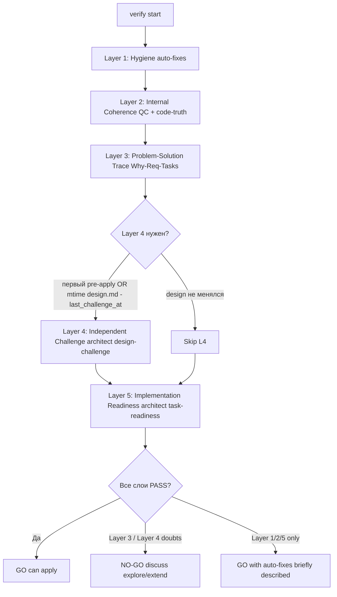

`/opsx:verify <name>` — независимое согласование ЗНИ перед `/opsx:apply`. Главный вопрос пользователя: «**могу ли я безопасно запустить apply?**» Ответ — бинарный (**GO** / **NO-GO**) и предъявлен в первой строке чата.

## Принципы

1. **Пять слоёв, в строгом порядке.** Каждый слой имеет единственную цель; пропуск/слияние слоёв запрещены, кроме явного триггера Layer 4.
2. **Бинарный вердикт.** Чат всегда даёт `GO` (можно apply) или `NO-GO` (на обсуждение). Не «WARNING/SUGGESTION», не «PASS/FAIL» в чат.
3. **Без скидок по объёму.** Глубина проверки одинакова для маленьких и больших ЗНИ — одна сломанная задача может остановить пользователя так же, как 25. **Исключение:** режимы `verify_depth` (`incremental`, `lite`) с guardrails — см. § «Verify depth» ниже; не ослабляют adversarial Layer 4 на первом прогоне.
4. **Verify чинит repair-класс сам.** Содержательные правки scope — через user `/opsx:extend`. Детерминированные пробелы постановки (карта repair в §2.6 `opsx-output-style.md`) — **internal Repair Loop** внутри verify, без user-facing extend и без «Подтвердить?».
5. **Один файл отчёта в день.** Полный отчёт `reports/verification-YYYY-MM-DD.md` создаётся, только если что-то найдено или исправлено; «тихий» прогон по фильтру новизны новый файл не пишет.
6. **Verify оценивает постановку, не приёмку.** Приёмочные тесты, тестовые данные, эталоны ИБ, smoke-проверки — это apply/archive (срез либо принят, либо нет). Verify не задаёт вопросов про тесты и не блокирует apply из-за отсутствия тестовых данных.

## Архитектура (5 слоёв)



## Режимы

Только два значения `verify_mode` в YAML отчёта:

- **`pre-apply`** — есть хотя бы одна `[ ]` в `tasks.md` (включая `S<N>.accept` и legacy `S<N>.T<M>`). Сюда же относятся «узкий verify одного среза» и «verify после принятого среза» — это контекстные подсценарии pre-apply, выводимые из текста запроса пользователя и состояния `debug.md` / `reports/slice-acceptance-*`.
- **`post-apply`** — все задачи `[x]`.

Старые значения (`slice-pre`, `slice-post`, `slice-scoped`, `slice-transition`, `legacy-pre`, `legacy-mixed`, `legacy-post`) **удалены** — больше не использовать ни в YAML, ни в чате, ни в именах файлов.

## Шаги (последовательно)

### 1. Select change

1. Если в запросе указано имя — использовать.
2. Если нет — `openspec list --json`, выбрать активную ЗНИ. При >1 активной — AskQuestion.
3. Имя сохранить как `<change-name>`.

### 1b. Scope Gate

Verify не правит scope артефактов. Если в запросе пользователя помимо команды verify есть **новое требование** или содержательная правка постановки (новые сценарии, изменения design):

- AskQuestion: **«Хотите дополнить артефакты этим требованием перед verify? `/opsx:extend <name>` (передать текст требования) / Запустить verify по текущим артефактам / Зафиксировать в TODO отчёта»**.
- При выборе extend — verify останавливается, оркестратор передаёт текст в `/opsx:extend`.
- При выборе «по текущим» — текст пользователя не учитывается в проверках, фиксируется в YAML отчёта `scope_gate_decision: ignore-extra` для аудита.
- При выборе «TODO» — записывается в info-секцию отчёта, на вердикт не влияет.

Если запрос — только имя ЗНИ — Scope Gate проходит молча.

### 1c. Verify depth и флаги запроса

Разобрать запрос пользователя:

| Флаг / условие | `verify_depth` | Слои |
|----------------|----------------|------|
| Первый verify или `decision_round=0`, без `--lite` | `full` | L1–L5 |
| После **user-extend** по decision (`decision_round>0`) | `incremental` | L1 diff + L4 targeted + L5 если менялся tasks |
| **Между срезами** (после приёмки `S<N>.accept`, запрос вида «проверь срез S<K>» / verify на slice-gate из apply) **и** design.md не менялся с последнего challenge | `incremental` | L2 + L5 по затронутому срезу; L4 `SKIPPED-novelty` (design не менялся) |
| `/opsx:verify <name> --lite` **и** нет открытой развилки **и** `decision_round=0` | `lite` | L2 + L5; L4 `SKIPPED-lite` |

**Guardrails `--lite`:** запрещён при `open_decision_id != null`, `decision_round > 0`, или открытой развилке в последнем отчёте. В чате: «проверена исполнимость без повторного независимого аудита постановки» (без слова lite в HALT).

**Guardrails `incremental`:** только после user-extend по decision **или** на границе среза (slice-gate); **не** после internal Repair Loop (repair → `verify_depth: full` как сейчас). Если `design_mtime` > `last_challenge_at` — incremental на границе среза недоступен, нужен `full` (L4 обязателен). `/opsx:apply` на slice-gate ссылается на этот режим вместо полного прогона.

Записать выбранный `verify_depth` в snapshot отчёта.

### 2. Load artifacts

Прочитать (с фиксацией mtime для snapshot):

- `openspec/changes/<name>/proposal.md`
- `openspec/changes/<name>/design.md` (mtime → `design_mtime` для решения по Layer 4)
- `openspec/changes/<name>/tasks.md`
- `openspec/changes/<name>/specs/**/*.md`
- `openspec/changes/<name>/debug.md` (если есть) — **обязательно** секция `## Verify decision ledger` (runtime SSOT closed decisions)
- `openspec/changes/<name>/reports/_manifest.yaml` (если есть)
- `openspec/project.md`

**Decision ledger (agent-only):** если в `debug.md` есть `## Verify decision ledger`, прочитать YAML-блок (`closed_decisions`, `decision_round`, `open_decision_id`, `assumptions_accepted`). Если секции нет — инициализировать пустой ledger в памяти оркестратора; при Save report синхронизировать в snapshot. Также прочитать design § «Решения verify (зафиксировано)» — UX-mirror для промпта L4 и блока «Уже зафиксировано» в чате.

### 3. Determine mode

Grep `tasks.md` на `^- \[[ ]\]` — если найдено хотя бы одно совпадение, `verify_mode = pre-apply`; иначе `post-apply`.

### 4. Novelty Check (фильтр повторных запусков)

1. Найти последний `reports/verification-*.md` (по дате в имени файла) и прочитать его YAML `snapshot`.
2. Сравнить с текущим состоянием:
   - `accepted_tasks` — список `[x]` в `tasks.md`. Если множество совпало → флаг `accepted_tasks: same`.
   - `artifacts_mtime` — каждый файл из `proposal/design/tasks/specs` имеет ту же ISO-метку, что в snapshot → флаг `artifacts: same`.
   - `last_challenge_at` ≥ `design_mtime` → флаг `challenge: actual`.
3. Если **все три** флага `same/actual` **И** в текущем запросе пользователя нет содержательных вопросов (был только триггер `/opsx:verify <name>`) — путь **`silent_ok`**:
   - **Не запускать слои 1–5.**
   - **Не создавать новый файл отчёта.**
   - Прочитать тело последнего `reports/verification-*.md` (не только YAML).
   - **Не опираться на историю чата** («вы уже подтвердили», prior turns) — только YAML `snapshot`, mtime артефактов и тело последнего отчёта.
   - В чат — «тихий» вариант `.cursor/skills/openspec-verify-change/templates/chat-summary.md`: **1a**, если прошлый вердикт «можно apply»; **1b-decision**, если есть открытая развилка; **1b-repair**, если только repair-блокеры — запустить **Repair Loop** (без сообщения в чат), затем один финальный ответ. Запрещено выводить список «Что доработать» пунктами в чате.
4. Если хотя бы один флаг разошёлся — продолжить со слоя 1.

### Layer 1 — Гигиена артефактов (тихая, авто-исправление)

**Цель:** убрать механические дефекты формы (пустые чекбоксы, лишние пробелы, регистр маркеров), которые засоряют чат и вертикаль проверок. Никаких вопросов пользователю.

**Что проверяется (механически):**

| Проверка | Действие | Алерт |
|---|---|---|
| Чекбоксы `- [ ]` отсутствуют у задач | Добавить | `task-missing-checkbox` (auto-fix) |
| Закрывающий `<!-- slice-gate -->` отсутствует в срезе | Записать с заглушкой | `missing-slice-gate-marker` (auto-fix) |
| Пустые буллеты, лишние пробелы | Нормализовать | `whitespace-normalized` (auto-fix) |
| `<!-- phase-gate -->` (legacy маркер фазы) | Заменить на пометку `legacy-phase-gate-deprecated` в info-секции отчёта | `legacy-phase-gate` (info) |
| Незакрытые backtick-блоки в `design.md`/`tasks.md` | Закрыть | `unbalanced-fences` (auto-fix) |
| ID задачи без префикса среза, когда есть `# Срез` | Лог в info без правки | `task-without-slice-prefix` (info) |

**Если правок не было** — записать `layer_1_hygiene: PASS`. Если были — `AUTOFIXED` + список в `### Авто-исправлено (Layer 1)` отчёта в техническом формате (файл, строка, что изменено); каркас таблицы — `.cursor/skills/openspec-verify-change/templates/layer-1-hygiene-table.md`.

Layer 1 **никогда** не блокирует — только правит или сообщает в info.

### Layer 2 — Внутренняя согласованность плана

**Цель:** артефакты не противоречат друг другу.

**2.1a. User Task Contract (mechanical pre-check)** — до QC: grep `tasks.md` по строкам `^- \[[ x]\] S\d+\.\d+` (не accept, не Follow-up) с таблицей DENY/ALLOW из `vertical-slices.mdc` § User Task Contract. Дополнительно: `При успешном verify S`, `после verify S`, `после стенда` в теле задачи → violation. Результат (список нарушений или «none») передать в промпт QC как **User Task Contract pre-check evidence**.

**2.1. Slice Coherence (Quality Controller)** — делегировать **`openspec-quality-controller`** (Task **без** `model=`, по `model-selection.mdc`). Промпт: см. `1c-agent-patterns/quality-controller.md`. Получить `reports/quality-control-YYYY-MM-DD.md`.

**Режим запуска:** `run_in_background: false` (sync, последовательно). Карточка Task не показывается в чате как отдельное сообщение — `tool_result` идёт во внутренний контекст оркестратора. В промпт обязательно включить блок **Final message constraint** из секции «Запуск агентов verify» ниже и блок **User Task Contract pre-check evidence** из 2.1a.

QC оценивает критерии 1–6, 8–11 из `vertical-slices.mdc` (Scenario Coverage, Slice Independence, Slice Completeness, Slice Dependency Graph, Slice Gate Integrity, Acceptance Checklist Coverage 5b amended, Rework Risk, Slice Verticality, Foundation slice with gate, Acceptance Simplicity, User Task Contract).

**2.2. Code-Truth (механический)** — для каждого технического имени в backticks из `design.md`/`tasks.md`/`debug.md`/`specs/**` запустить `Grep` по путям из `openspec/project.md`. См. `.cursor/rules/code-truth-gate.mdc`.

В `pre-apply` — `phantom-symbol` = WARNING; в `post-apply` — для `[x]` задач/принятых срезов CRITICAL (см. `code-truth-gate.mdc`).

**2.3. Spec ↔ Tasks ↔ Design coverage** — каждый `#### Scenario:` из `specs/**/spec.md` должен встречаться в `## Slices` design (строка «Scenarios из spec») И в чеклисте какого-то `S<N>.accept`. Иначе — алерт `scenario-orphan-design` или `scenario-orphan-accept`.

**2.4. Cross-Archive Regression Audit (precedent regression)** — защита от молчаливой отмены ранее принятого контракта. **SSOT (триггеры, алгоритм, матрица severity, бюджет ≤10 архивов):** `.cursor/rules/precedent-regression-gate.mdc`, секция «АЛГОРИТМ VERIFY LAYER 2.4» — Read и выполнить, здесь не дублируется. Выполняется в `pre-apply`; в `post-apply` для непринятых задач/срезов; пропускается, когда все задачи `[x]` (постфактум приёмка не пересматривает регрессию дельты). CRITICAL `precedent-regression` / `invariant-drift` / `load-bearing-adr-bypass` → класс **decision** в Repair Loop.

**Итоговый статус слоя:**

- `PASS` — все критерии OK / только INFO.
- `WARNING` — есть несущественные несостыковки (один scenario без покрытия в матрице, лишний legacy-маркер). На вердикт идёт как «не блокирует apply».
- `FAIL` — циклы зависимостей срезов, `accept-checklist-empty`, `primary-acceptance-missing`, `acceptance-simplicity-overload`, `slice-not-vertical`, `slice-foundation-with-gate`, `user-task-contract-violation`, дублирование `S<N>.accept` в одном срезе, CRITICAL `phantom-symbol` в post-apply, или CRITICAL precedent-regression (`precedent-regression` / `invariant-drift` / `load-bearing-adr-bypass`).

`FAIL` в Layer 2 — это **NO-GO**.

### Layer 3 — Problem-Solution Trace

**Цель:** план реально решает проблему из `## Why`, а не похожую.

Проверки (детерминистические):

1. **Why → Requirements.** В `proposal.md` `## Why` есть пункты, не покрытые ни одним `### Requirement` в `specs/**/spec.md`? → `why-orphan-requirement` (FAIL).
2. **Requirements → Scenarios.** Каждый `### Requirement` имеет ≥1 `#### Scenario:`? Иначе → `requirement-orphan-scenario` (FAIL).
3. **Scenarios → Slices.** Каждый `#### Scenario:` упомянут в `## Slices` design.md? Иначе → `scenario-orphan-slice` (WARNING — может быть подобрано в Layer 2; FAIL только если несовпадение системное).
4. **Slices → Acceptance.** Каждый Scenario, заявленный в `**Связь со spec:**` среза, есть буллетом в чеклисте `S<N>.accept` этого среза? Иначе — алерт `accept-bullets-missing-scenario` (WARNING) от Layer 2 (5b QC); Layer 3 не дублирует.
5. **Slices → Tasks.** Для каждого среза есть рабочие задачи (`S<N>.<M>`) И ровно одна `S<N>.accept`. Срез без рабочих задач — алерт `slice-empty` (FAIL).
6. **Scenario observability (`scenario-implementation-leak`).** Grep `specs/**/spec.md`: для каждого `#### Scenario:` проверить `- **THEN**` на маркеры implementation-leak (см. `.cursor/rules/openspec-specs-gate.mdc` секция «НАБЛЮДАЕМОСТЬ СЦЕНАРИЕВ»). При совпадении — **WARNING** `scenario-implementation-leak`; рекомендация: переписать THEN наблюдаемо, детали — в design.md. Не эскалирует в FAIL Layer 3, но включается в отчёт verify.
7. **Metadata domain_label (`process-only-marker-suffix`).** Read `proposal.md` § `## Metadata (comment markers)` (dual-parser: yaml или list). Если `comment_suffix` match запретам `openspec/project.md` § Канон domain_label — **WARNING** `process-only-marker-suffix`; рекомендация: переписать suffix или `/opsx:extend` перед apply. Не FAIL Layer 3.

`FAIL` в Layer 3 — **NO-GO**.

### Layer 4 — Independent Challenge (архитектурный адверсариальный аудит)

**Цель:** независимое подтверждение, что выбранный design **решает** проблему **оптимальным** способом. Это не дублирует Architect Gate из new/explore: new даёт согласие на подход (auctorial), challenge даёт независимое подтверждение (adversarial). Подробности — `.cursor/rules/architect-gate.mdc` секция «INDEPENDENT CHALLENGE».

**Триггеры запуска (любой):**

- Это **первый** `/opsx:verify` по этой ЗНИ (нет ни одного `reports/verification-*.md` или ни в одном snapshot нет `last_challenge_at`).
- `mtime(design.md) > snapshot.last_challenge_at` (design менялся со времени последнего challenge — например, после `/opsx:extend`).
- `verify_depth = incremental` — Layer 4 **targeted** (delta design + closed decisions), не полный adversarial re-run всех альтернатив.

**Когда Layer 4 пропускается:**

- `verify_depth = lite` → `layer_status.layer_4_independent_challenge: SKIPPED-lite`.
- Триггеры не сработали (`mtime(design.md) ≤ last_challenge_at`) **и** `verify_depth ≠ incremental` → `SKIPPED-novelty`.
- В корне change есть `.gate-override.yaml` с `gate: design-challenge` — прочитать поле `timestamp`:
  - **≤ 7 дней** — пропуск с предупреждением в чат («Независимый аудит постановки отложен по вашему решению от <дата> (причина: <reason>); отсрочка истекает через <N> дней»). YAML: `layer_status.layer_4_independent_challenge: SKIPPED-override`.
  - **> 7 дней** — отсрочка истекла: **override игнорируется**, Layer 4 запускается как обычно. В info-секцию отчёта — `gate-override-expired`. Не давать молчаливый бессрочный обход.

**Запуск:**

1. Делегировать `onec-code-architect` с `mode=design-challenge` по таблице моделей (`model-selection.mdc`, цепочка для архитектора).
2. **Режим запуска:** `run_in_background: true` (параллельно с sync-агентами Layer 2/5). Самый длинный шаг verify; параллелизм нужен, иначе verify становится в 2.5x длиннее. В чате остаётся **одна короткая карточка** (одна строка пути к файлу) — это допустимо как фоновый прогресс-маркер и не нагружает внимание. В промпт обязательно включить блок **Final message constraint** (секция «Запуск агентов verify» ниже).
3. Промпт включает:
   - `proposal.md`, `design.md`, `specs/**/spec.md` — как первичные источники.
   - **Обязательный блок Closed decisions** (из `debug.md` § Verify decision ledger + design § «Решения verify (зафиксировано)»):
     ```markdown
     ## Closed decisions (mandatory context)
     <paste closed_decisions summaries + design mirror prose>

     You MAY challenge closed decisions in the report file with verified code facts.
     Tag reopening alternatives: reopen-blocked: <decision_id>.
     Prefer implementation_invariant gaps over architectural forks when closed axis holds.
     ```
   - При `verify_depth = incremental`: ограничить scope — «проверь только delta design с прошлого challenge и инварианты очистки/контекста; не переоткрывай closed decisions без verified new fact».
   - **Запрет** опираться на `reports/architecture-*.md` собственного авторства как на источник истины.
   - Инструкции по адверсариальной установке, Three-Question Challenge и формату отчёта (см. `.cursor/agents/onec-code-architect.md` секция «Режим `design-challenge`»).
4. Результат — `reports/design-challenge-YYYY-MM-DD.md` с YAML `verdict: APPROVE | CHALLENGE | REJECT`.

### Post-challenge classifier (оркестратор, после Layer 4, до синтеза чата)

**Цель:** adversarial Layer 4 не ослабляется; фильтр и reclassify — на оркестраторе. Пользователь **не** видит agent-keys (`decision_id`, `reopen-blocked`).

| Сигнал в design-challenge | Действие |
|---------------------------|----------|
| Gap закрывается правкой design/tasks **без** смены closed axis | **Repair Loop** (`implementation_invariant`) |
| Alternative отменяет closed `decision_id` **без** verified new fact в отчёте | **Drop** — не в чат; log в info «reopen-closed-decision filtered» |
| Alternative + **verified new fact** (код, единственный caller) | **`supersedes`**: одна прозаичная эскалация «подтверждаете X, несмотря на Y?» — не A/B с отменой closed |
| `assumption_deferrable` / load-bearing без блокера | Кандидат **GO-saturated** (см. § GO-saturated) |
| Layer 4 **REJECT** + gap корректности / security / resource-leak | **Всегда NO-GO** — cap не применяется |

**Маппинг вердикта на статус слоя и чат:**

- `APPROVE` → `layer_status.layer_4_independent_challenge: APPROVE` → не блокирует apply. Обновить `snapshot.last_challenge_at = mtime(design.md)`.
- `CHALLENGE` → после **Post-challenge classifier**: если только `implementation_invariant` → Repair Loop; если `drop reopen` → не NO-GO; если `supersedes` → одна эскалация в чат; иначе **NO-GO** с развилкой (максимум одна). `last_challenge_at` обновляется при CHALLENGE, прошедшем в чат или repair.
  - **Defensive filter:** workflow-формулировки — как раньше.
  - **Defensive filter reopen:** альтернатива с тегом `reopen-blocked: <id>`, противоречащая `closed_decisions` без verified new fact — **не** в чат.
- `REJECT` → после classifier: если gap = `implementation_invariant` only → Repair; иначе **NO-GO**. `last_challenge_at` **не обновляется** при REJECT, блокирующем apply.

**Важно:** Layer 4 нельзя «обойти» прогоном `--skip-architect`, переданным в new. Этот флаг закрывает только Architect Gate из new. Layer 4 verify имеет собственный override-механизм через `.gate-override.yaml gate: design-challenge`.

### Layer 5 — Implementation Readiness (реализуемость)

**Цель:** задачи реально можно реализовать as-is. Это **не** пересмотр архитектурного подхода (это сделал Layer 4) — узкий фокус на исполнимости.

Делегировать `onec-code-architect` с `mode=task-readiness` (промпт см. `1c-agent-patterns/architect.md`). **Режим запуска:** `run_in_background: false` (sync). Карточка Task не отображается в чате. В промпт обязательно включить блок **Final message constraint** (секция «Запуск агентов verify» ниже). Архитектор оценивает:

1. Каждая задача `S<N>.<M>` имеет конкретные файл/процедуру/объект (по правилу `task-readability.mdc`)?
2. Контракты данных (`Свойство()`/`ТипЗнч()`/защитные проверки) — оправданы (Data Contract Gate)?
3. Есть ли в плане «фикс симптома» вместо корня (для bug-fix change — критерий из `verified-cause-gate.mdc` HALT 1/2)?
4. Порядок задач не создаёт «петлю» — нет ли задачи, которая ссылается на ещё не созданный объект?

**8. User Task Contract** — user runtime-spike в `S<N>.<M>` (ИБ, консоль, отладчик, эмуляция API без UX-proxy) → **GAP (блокирует GO)**. **Запрещено** трактовать spike как «штатный apply-gate / не дефект постановки». Out of scope (нет тестовых данных) **не отменяет** structural user-spike. См. `vertical-slices.mdc` § User Task Contract.

**5.1. Manual Configuration Sufficiency (механический, до архитектора).** Grep `tasks.md` (case-insensitive) на маркеры ручной конфигурации: «вручную», «в Конфигураторе», «создать реквизит», «добавить измерение», «настроить роль», «элемент формы», «реквизит формы». Если маркеры найдены — в `design.md` должна быть **дословная таблица-доказательство**: конкретные имена объектов/реквизитов, типы, элементы формы, которые пользователь создаёт руками. Нет полной таблицы (есть требование ручной настройки, но в design только общая фраза без имён/типов) → `manual-config-incomplete` (CRITICAL) → **NO-GO**. Это страховка: без точных имён разработчик не выполнит ручную часть, и apply встанет. Если маркеров нет — записать «маркеров ручной конфигурации не найдено» в info, без правок.

Архитектор сохраняет `reports/architecture-task-readiness-YYYY-MM-DD.md`.

**Маппинг:**

- Нет GAP / минорные → `PASS`.
- WARNING-уровень GAP (нечёткие формулировки, недостающие ссылки) → `WARNING` (не блокирует).
- CRITICAL GAP (нереализуемая as-is задача) **или** `manual-config-incomplete` (5.1) → `FAIL` → **NO-GO**.

### Финальный вердикт

```
verdict = GO  if and only if
  layer_1_hygiene ∈ {PASS, AUTOFIXED}
  AND layer_2_internal_coherence ∈ {PASS, WARNING}
  AND layer_3_problem_solution ∈ {PASS, WARNING}
  AND layer_4_independent_challenge ∈ {APPROVE, SKIPPED-novelty, SKIPPED-override, SKIPPED-lite, CHALLENGE-saturated}
  AND layer_5_implementation_readiness ∈ {PASS, WARNING}

verdict = NO-GO  otherwise
```

### GO-saturated (decision fatigue cap)

Применяется **только если** одновременно:

- `decision_round >= decision_round_max` (default 2), **и**
- L2/3/5 = PASS или WARNING без FAIL, **и**
- остаток L4 после classifier = `assumption_deferrable` **или** duplicate challenge по тому же closed axis (de-dupe), **и**
- Layer 4 **не** REJECT с gap корректности / security / resource-leak.

Тогда: `verdict: GO`, `layer_4: CHALLENGE-saturated`. В чат (вариант 2): «можно apply; остаточный риск … проверяется в S1.accept» — **без** agent-keys.

**REJECT с утечкой контекста / security → всегда NO-GO**, cap не спасает.

Явный accept risk пользователя («принимаю риск», «apply без further verify») → `assumptions_accepted` в ledger + GO; одна строка прозой в design § Risks.

Любой `FAIL` в Layer 2/3/5 → NO-GO.
Layer 4 `CHALLENGE` или `REJECT` → NO-GO **кроме** CHALLENGE-saturated и случаев, когда classifier перевёл всё в repair/drop.

### Save report

Если хоть один слой не `PASS` либо были автоправки — сохранить `reports/verification-YYYY-MM-DD.md` строго в следующем порядке (полный шаблон — `.cursor/skills/openspec-verify-change/templates/executive-summary.md` и `.cursor/skills/openspec-verify-change/templates/report-header.md`):

1. **YAML front-matter** — `.cursor/skills/openspec-verify-change/templates/report-header.md`. Внутреннее состояние (verdict, layer_status, snapshot) для движка и фильтра новизны.
2. **`## Резюме для разработчика`** — первый видимый раздел. Зеркало финального сообщения чата + 1–2 абзаца контекста (модули, процедуры, директивы). На языке кода 1С, без жаргона движка.
3. **`## Решения до apply`** — только при NO-GO. Развёрнутые развилки прозой; каждая `###` с конкретными именами `Функция/Процедура/Модуль/Реквизит`. Внутренние коды развилок — НЕ здесь.
4. **`## Что меняется в постановке`** — карточка изменений для разработчика: путь в `src/`, точки изменения, что НЕ меняется, связанные ADR/KB/архив.
5. **`### Подправил в постановке`** — авто-правки гигиены простыми словами (если были); список правок в техническом формате уходит в `## Технический аудит`.
6. **`### К сведению`** — мелочи, не блокирующие apply.
7. **`## Технический аудит (для движка OpenSpec)`** — статусы пяти слоёв, технический формат. **Только здесь** допустимы имена `Layer 1..5`, `PASS/FAIL`, `CHALLENGE/APPROVE/REJECT`, `design-challenge`, `task-readiness`, `phantom-symbol`, `slice coherence`.
8. **`## Источники`** — пути к дочерним отчётам (`quality-control-*.md`, `design-challenge-*.md`, `architecture-task-readiness-*.md`), технические коды алертов.

Если verify повторный в один день — суффикс `-2`, `-3` и т. д.

При `silent_ok` (шаг 4) — **новый файл не создаётся**. Если прошлый вердикт «до apply нужно решение» — в чат выводятся развилки из последнего отчёта (Вариант 1b); иначе — тихий вариант 1a. Ссылка в конце — на последний `reports/verification-*.md`.

### Output to chat

Использовать `.cursor/skills/openspec-verify-change/templates/chat-summary.md`. Первая строка — `.cursor/skills/openspec-verify-change/templates/verdict-card.md`. Pre-send — `.cursor/rules/verify-user-communication.mdc` + Chat Surface Contract (§2.6 `opsx-output-style.md`). HALT — `.cursor/rules/chat-output-budget.mdc` §7. Тон — архитектор разработчику, на языке кода 1С.

**HARD — слот «Следующий шаг»:** при GO / GO-saturated / silent_ok 1a — **всегда** строка `**Следующий шаг:**` с user-action командой:

- `verify_mode = pre-apply` → `/opsx:apply <change-name>`
- `verify_mode = post-apply` → `/opsx:archive <change-name>`

Для silent_ok читать `verify_mode` из YAML `snapshot` последнего отчёта, **не** hardcode apply.

При decision — `**Следующий шаг:** ответьте в чате (A или B)…`; при terminal fail — чат или `/opsx:extend <name>`.

Self-check: «можно действовать без файла» = пользователь видит **конкретную команду** или явное приглашение ответить в чате.

**Одна команда `/opsx:verify` → одно финальное сообщение в чат** (допустим progress marker при длинном Repair Loop).

### Repair Loop (internal, max 2 attempts)

После NO-GO классифицировать блокеры по карте repair/decision (§2.6 `opsx-output-style.md`, `layer_status` и коды алертов отчёта):

1. **Decision blockers** (CHALLENGE/REJECT с A/B **после classifier**, `scope-violation`, FAIL с продуктовым выбором, Why ↔ plan, `supersedes`) → chat **3a-decision**, **END TURN**. Repair не запускать без ответа пользователя.
2. **Repair only** (включая `implementation_invariant` от classifier) + `repair_attempt < 2`:
   - Вызвать `apply_repairs_from_report()` — internal `/opsx:extend <name> --from-verify <отчёт>` в режиме **repair-from-verify** (без брифа, без сообщений в чат; порядок правок — extend §6).
   - **Не END TURN** → полный re-verify (слои 1–5) с `repair_attempt + 1`.
   - **0 промежуточных сообщений** в чат; допустима одна строка progress marker (§6 `chat-output-budget.mdc`): «Дописываю постановку…».
3. **Decision всплыл на attempt 2** (repair открыл скрытую развилку) → chat **3a-decision**, **END TURN**. **Не** считать terminal fail.
4. **Repair всё ещё нужен после attempt 2** → terminal: «не удалось дочинить автоматически за 2 итерации» + краткая суть на языке эффекта + ссылка на отчёт. **Не** молчать и **не** ping-pong extend→verify в чате.
5. **GO** на любой итерации → один chat-summary (вариант 2).

**Смешанный отчёт (repair + decision):** decision имеет приоритет → сначала 3a-decision; repair после ответа пользователя через user-extend `--from-verify`.

**Self-check перед финалом repair-path:** ответ самодостаточен для пользователя **без prior turns** и **без открытия файлов**?

### Update snapshot

После сохранения отчёта обновить YAML `snapshot` **и** синхронизировать `debug.md` § Verify decision ledger:

- `accepted_tasks` — текущий список `[x]`.
- `artifacts_mtime` — текущие mtime каждого артефакта.
- `closed_decisions`, `decision_round`, `open_decision_id`, `verify_depth`, `assumptions_accepted` — из runtime ledger.
- `last_challenge_at` — обновить **только** если Layer 4 был запущен и вернул `APPROVE` или `CHALLENGE` (в т.ч. saturated). При `REJECT`, блокирующем apply — не трогать.
- `open_known_questions` — список открытых тем; **удалить** темы, закрытые через `closed_decisions` (sync с ledger).

## Запуск агентов verify (гибридный режим)

### Таблица

| Layer | Агент | Mode | `run_in_background` | Когда |
|---|---|---|---|---|
| 2 | `openspec-quality-controller` | — (без `model=`) | **false** (sync) | Всегда |
| 4 | `onec-code-architect` | `design-challenge` | **true** (background) | По триггеру (см. Layer 4) |
| 5 | `onec-code-architect` | `task-readiness` | **false** (sync) | Всегда |

### Порядок (минимум видимых карточек, без удвоения времени)

1. **Запустить design-challenge в background** (если триггер Layer 4 сработал) — `run_in_background: true`. Карточка Task в чате будет, но свёрнутая до одной строки благодаря Final message constraint.
2. **Запустить QC sync** — `run_in_background: false`. Дождаться результата. Карточки в чате нет.
3. **Запустить task-readiness sync** — `run_in_background: false`. Дождаться результата. Карточки в чате нет.
4. **Дождаться завершения design-challenge** (если ещё не завершён).
5. **Синтез** — оркестратор пишет **одно** финальное сообщение пользователю по `.cursor/skills/openspec-verify-change/templates/chat-summary.md`. Промежуточные карточки Task **не цитируются** и **не упоминаются**.

### Final message constraint (HARD — обязательно в каждом промпте)

В **каждый** промпт Task (QC, design-challenge, task-readiness) включить блок дословно:

```
## Final message to chat (HARD CONSTRAINT)

Your final assistant message in this turn is a single line:
"Отчёт сохранён: <full path to file>".

Do NOT include verdict, severity, slice coherence summary, layer name,
simplicity check, three-question challenge, recommendations, or any other
analysis в финальном сообщении. Full analysis goes ONLY to the saved
markdown file.

Reason: the user does NOT read your final message. The orchestrator reads
the file and synthesizes a single message for the user. Anything you put
в финальный assistant message becomes user-visible chat noise.
```

Без этого блока промпт verify считается некорректным — карточка Task
протекает в чат с внутренним языком модели.

### Сбой субагента

При сбое субагента — следовать **«Целостность цепочки Task»** в `.cursor/rules/model-selection.mdc`. Не подменять отчёт собственным текстом до исчерпания цепочки. Layer 4 при полностью исчерпанной цепочке без согласия пользователя на обход — **NO-GO** с пометкой «Не удалось выполнить независимый аудит — повторите позже либо явно обойдите через `.gate-override.yaml`».

## Фильтрация и приоритизация замечаний

В отчёт попадает то, что меняет вердикт или требует решения. Внутренние интерфейсные понятия (`Promotion Test`, `Implementation Impact`, `determinism`, `card-consolidation`) **остаются в логике скилла**, но **не появляются** в чате и не выводятся пользователю как ярлыки — все обсуждения идут на пользовательском языке.

Запрещено в чат: «PASS / FAIL / verdict: GO / Layer N / design-challenge / task-readiness / phantom-symbol / CRITICAL / WARNING / SUGGESTION». Эти технические коды — только в YAML отчёта и в строке `Источники: …` файла. Полный список запрещённых подстрок — `.cursor/rules/chat-output-budget.mdc` §7.

## Что НЕ делает verify

- **Не правит scope** (proposal/design/tasks/specs) через user-facing extend — только Layer 1 авто-гигиена и **internal Repair Loop** для repair-класса.
- **Не мигрирует** legacy tasks в срезы автоматически — рекомендует `/opsx:extend <name>` или ручную правку; не объединяет `S<N>.T<M>` в `S<N>.accept` без правки артефакта.
- **Не выполняет** apply, не отмечает задачи `[x]`.
- **Не оценивает** выполнимость приёмочных тестов пользователем.
- **Не требует** тестовые данные или эталоны ИБ (это зона ответственности apply/archive).

## Legacy compat (acceptance)

Активные ЗНИ, созданные до введения `S<N>.accept`, могут содержать множественные `S<N>.T<M>` per slice. Verify работает с ними без падений:

- Layer 2 (QC критерий 5) использует legacy-ветку (см. `vertical-slices.mdc`): один или несколько `S<N>.T<M>` без `S<N>.accept` не падают на CRITICAL `Slice Gate Integrity`; QC выдаёт `legacy-acceptance-format` (SUGGESTION) с предложением объединить `T<M>` в один `S<N>.accept` вручную.
- Layer 2 5b — legacy-алерт `acceptance-without-scenario` (WARNING).
- Layer 3 — Scenario `**Связь со spec:**` matched либо в чеклист `S<N>.accept`, либо в legacy `S<N>.T<M>` (по хвостовой скобке `(Scenario: «…»)`).
- Layer 5 — архитектор оценивает выполнимость и старого, и нового формата.

В отчёте verify в info-секции — одна строка «Старая модель приёмки. Можно вручную объединить `S<N>.T<M>` в один `S<N>.accept` с чеклистом сценариев.»

## Ссылки

- Слои, шаблоны, YAML, чат — `.cursor/skills/openspec-verify-change/templates/`.
- Коммуникация — `.cursor/rules/verify-user-communication.mdc`.
- Бюджет чата — `.cursor/rules/chat-output-budget.mdc`.
- Architect Gate / Layer 4 vs new — `.cursor/rules/architect-gate.mdc`.
- Code-Truth — `.cursor/rules/code-truth-gate.mdc`.
- Verified Cause — `.cursor/rules/verified-cause-gate.mdc`.
- Vertical Slices / acceptance format — `.cursor/rules/vertical-slices.mdc`.
- Архитектор — `.cursor/agents/onec-code-architect.md` (режимы `design-challenge`, `task-readiness`).
- Quality Controller — `.cursor/agents/openspec-quality-controller.md`.
