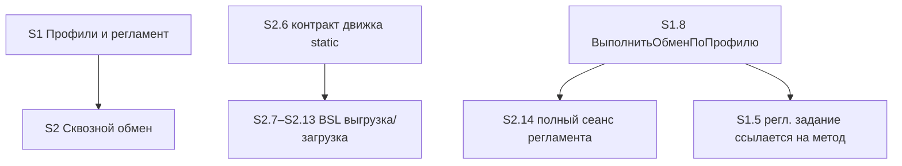

# Quality Control — Slice Coherence (Layer 2)

- **Change:** universal-xml-exchange
- **Дата:** 2026-06-22 (прогон 3)
- **Режим:** slice mode (`# Срез S1`, `# Срез S2` обнаружены)
- **Артефакты:** tasks.md, design.md, proposal.md, specs/ (4 capability)

---

## Verdict

**CRITICAL**

- **Slice Coherence (критерии 1–11):** OK — структура срезов, покрытие сценариев, граф зависимостей, slice-gate, наблюдаемость приёмки и User Task Contract нарушений не имеют.
- **CRITICAL вынесен из cross-cutting находок** (метадрейф artefacts↔выгрузка и неназначаемое право регламентного задания), переданных оркестратором. Эти находки лежат вне узких критериев slice-coherence (это Layer 3/4 Code-Truth / валидация метаданных), но материальны для готовности к apply и приводят к гарантированной переделке, если apply пойдёт по текущим tasks.md/design.md.

---

## Slice Summary

| Slice | Scenario | Tasks | Acceptance | Dependencies | Gate |
|---|---|---|---|---|---|
| S1 | Профили обмена и регламентные задания | S1.1–S1.11 (10 задач + accept) | `S1.accept` (Primary + 2 «включено в Primary» + 3 optional) | нет | `<!-- slice-gate -->` присутствует |
| S2 | Сквозной обмен данными (источник + приёмник) | S2.1–S2.15 (15 задач + accept) | `S2.accept` (Primary + 1 «включено в Primary» + 4 optional) | S1 | `<!-- slice-gate -->` присутствует |

- Slice-gate integrity: ровно один `S<N>.accept` и один маркер `<!-- slice-gate -->` на срез — OK.
- Primary acceptance: присутствует в metadata и в теле accept обоих срезов — OK.
- Acceptance simplicity: один mandatory Primary journey на срез — OK (остальные помечены «включено в Primary» либо «опционально»).

---

## Scenario Coverage

20 `#### Scenario:` из 4 capability. Все покрыты (Primary, optional accept или агентская задача `S<N>.<M>` — допустимо по правилу среза 6).

| # | Scenario | Capability | Покрытие | Статус |
|---|---|---|---|---|
| 1 | Создание профиля с обязательными реквизитами | exchange-settings | S1.accept Primary | Covered |
| 2 | Запись пароля при сохранении профиля | exchange-settings | S1.accept Primary + S1.7/S1.10 | Covered |
| 3 | Использование пароля при обмене | exchange-settings | S2.accept Primary (e2e) + S2.10 | Covered |
| 4 | Настройка параметров фильтрации | exchange-settings | S1.accept optional + S1.2 | Covered |
| 5 | Включение регламентного обмена | exchange-settings | S1.accept optional + S1.9 | Covered (см. блокер C2) |
| 6 | Отключение регламентного обмена | exchange-settings | S1.accept optional + S1.9 | Covered |
| 7 | Публикация сервиса | exchange-web-service | S2.accept optional + S2.3 | Covered |
| 8 | Успешный вызов GetData | exchange-web-service | S2.9 + S2.accept Primary e2e | Covered |
| 9 | Передача параметров фильтрации | exchange-web-service | S2.accept optional + S2.7 | Covered |
| 10 | Загрузка правил из макета | exchange-export | S2.7 | Covered |
| 11 | Подстановка параметров перед выгрузкой | exchange-export | S2.7 | Covered |
| 12 | Полная выгрузка по правилам | exchange-export | S2.7 | Covered |
| 13 | Примитивный параметр без обработчика в правилах | exchange-export | S2.6 (static) | Covered (agent static) |
| 14 | Сжатие выгрузки | exchange-export | S2.8 | Covered |
| 15 | Ручной запуск обмена | exchange-import | S2.accept Primary + S2.15 | Covered |
| 16 | Регламентный запуск | exchange-import | S2.accept optional + S2.14 | Covered |
| 17 | Подготовка сеанса по профилю | exchange-import | S2.10 | Covered |
| 18 | Успешный запрос данных | exchange-import | S2.11 | Covered |
| 19 | Загрузка после получения архива | exchange-import | S2.12 + Primary | Covered |
| 20 | Недоступность веб-сервиса | exchange-import | S2.accept optional + S2.13 | Covered |

Пропусков покрытия нет → алертов `accept-bullets-missing-scenario` / `accept-bullet-foreign-scenario` нет.

---

## Dependency Graph

- Slice-to-slice: только «назад» (S2 → S1). Циклов нет. S1 принимаем независимо от S2.
- Intra-slice: S2.6 объявлен блокирующим S2.7–S2.13 (есть в тексте задачи); S2.14 ссылается на S1.8; S1.5 зависит от S1.8 — все объявлены. OK.
- Несоответствий объявленных зависимостей нет.

---

## Slice Coherence — критерии 1–11

| Критерий | Результат |
|---|---|
| 1. Scenario Coverage | OK — 20/20 покрыты |
| 2. Slice Independence | OK — S1 принимаем без S2; зависимости «назад» |
| 3. Slice Completeness | OK — в каждом срезе есть метаданные, форма, BSL, приёмка |
| 4. Slice Dependency Graph | OK — зависимости объявлены, дед существует, циклов нет |
| 5. Slice Gate Integrity | OK — по одному `S<N>.accept` + `<!-- slice-gate -->` |
| 5b. Acceptance Checklist Coverage | OK — Primary присутствует, все Scenario покрыты |
| 6. Rework Risk (узкое определение) | OK по структуре срезов; **см. cross-cutting C1/C2 — реальный rework-risk из метадрейфа** |
| 8. Slice Verticality | OK — Primary обоих срезов описывают black-box user-journey |
| 9. Foundation slice with gate | OK — S1 даёт самостоятельный наблюдаемый outcome (профиль создан, пароль скрыт), не foundation-only |
| 10. Acceptance Simplicity | OK — один mandatory Primary journey на срез |
| 11. User Task Contract | OK — все `S<N>.<M>` либо ручная конфигурация/выгрузка (ALLOW), либо агентская правка BSL / static-сверка; runtime-spike пользователя нет |

### Task Readability

OK. Формулировки следуют паттерну «глагол + файл/объект + изменение + бизнес-результат + опорная ссылка». Приёмочные задачи `S<N>.accept` соответствуют формату (бизнес-результат в заголовке, чеклист сценариев в теле). Алертов `task-opaque-title` / `task-too-short` / `task-opaque-acceptance` нет.

---

## Cross-cutting findings (переданы оркестратором — вне узких критериев slice-coherence)

> Эти находки относятся к Code-Truth / валидации метаданных (Layer 3/4), а не к slice-coherence. Включены по запросу. Они определяют итоговый CRITICAL: при apply по текущим artefacts работа пойдёт по несуществующим символам.

### C1 — Метадрейф artefacts ↔ выгрузка `src/` (CRITICAL, decision-required)

tasks.md и design.md описывают объекты/реквизиты с именами, которые **не совпадают** с фактической выгрузкой в `src/ЗУП/cfe/рг_УниверсальныйОбменXML/`. Расхождение почти по каждому именованному символу:

| Сущность | В tasks.md / design.md | В фактической выгрузке `src/` |
|---|---|---|
| Справочник | `ргНастройкиОбменаXML` | `рг_НастройкиОбменаXML` (подчёркивание после `рг`) |
| Реквизит URL | `обменXML_URL` | `АдресСервиса` |
| Реквизит логин | `обменXML_ИмяПользователя` | `Логин` |
| Реквизит имя макета | `обменXML_ИмяМакетаПравил` | `ИмяМакетаПравил` (без префикса) |
| Реквизит флаг регламента | `обменXML_ИспользоватьРегламентныйОбмен` | `ИспользоватьРасписание` |
| Реквизит расписание | (нет отдельного) | `Расписание` |
| Реквизит идентификатор задания | `обменXML_ИдентификаторРегламентногоЗадания` | `ИндентификаторРегламентногоЗадания` (sic — опечатка в выгрузке) |
| Табличная часть | `обменXML_Параметры` (`Имя` / `Значение`) | `Параметры` (`ИмяПараметра` / `ЗначениеПараметра`) |
| Регламентное задание | `ргВыполнениеОбменаXML` | `рг_ВыполнениеОбменаXML` |
| Общий модуль | `ргУниверсальныйОбменXMLСервер` | `рг_УниверсальныйОбменXMLСервер` |
| Роль | `обменXML_ОсновнаяРоль` | `рг_ИспользованиеОбменаXML` |

**Влияние:** манипулятивные задачи (S1.1–S1.4, S1.7–S1.10, S2.x) ссылаются на пути/имена, которых нет в выгрузке. Часть ручной конфигурации **уже выполнена** (объекты выгружены, `ObjectModule.bsl` и `Form/Module.bsl` существуют пустыми) — но под другими именами. Если apply пойдёт по tasks.md, writer будет адресовать несуществующие модули/реквизиты, а ручные задачи будут предлагать создать уже существующие объекты под устаревшими именами.

**Также:** proposal/design фиксируют префикс расширения `обменXML_`; фактическая выгрузка реквизитов справочника префикс **не использует** (`АдресСервиса`, `Логин`, `Расписание`). Это расхождение конвенции, требующее решения.

**Это decision-required, не auto-repair.** Нужно выбрать источник истины:
- **A (рекомендуется):** выгрузка `src/` — фактическая реальность (объекты созданы). Привести tasks.md и design.md (§ Manual Configuration, § Engine Contract, D4) и accept-критерии к as-built именам: `рг_НастройкиОбменаXML`, реквизиты `АдресСервиса/Логин/ИмяМакетаПравил/ИспользоватьРасписание/Расписание/ИндентификаторРегламентногоЗадания`, ТЧ `Параметры` (`ИмяПараметра/ЗначениеПараметра`), `рг_ВыполнениеОбменаXML`, модуль `рг_УниверсальныйОбменXMLСервер`, роль `рг_ИспользованиеОбменаXML`.
- **B:** переименовать метаданные в Конфигураторе под artefacts (дороже, перевыгрузка) — оправдано только если префиксная конвенция `обменXML_` обязательна.

Канал устранения: `/opsx:extend universal-xml-exchange --code-sync` (explorer читает as-built → артефакты догоняют) либо ручная правка artefacts перед apply.

### C2 — Право на регламентное задание в роли неназначаемо (WARNING, формулировочный дефект задачи)

Задача **S1.11** требует «выдать роли … права на … регламентное задание `ргВыполнениеОбменаXML`». В платформе 1С регламентные задания **не являются объектом прав** в Rights.xml — они не отображаются в редакторе прав роли. Подтверждение: grep по всем Rights.xml ЗУП cf даёт ноль записей `ScheduledJob.*`. БСП-паттерн: выполнение регламентного задания идёт под привилегированным режимом из модуля объекта (`РегламентныеЗаданияСервер`), пример — `cf Catalogs/РассылкиОтчетов/Ext/ObjectModule.bsl`.

**Влияние:** часть формулировки S1.11 («и регламентное задание») невыполнима в Конфигураторе → ручная конфигурация застопорится; пользователь уже столкнулся с этим. На Primary S1 не влияет (профиль/пароль), но блокирует выполнение manual-config задачи.

**Remediation:** убрать из S1.11 пункт о праве на регламентное задание; оставить только право на справочник. Зафиксировать в design § Assumptions инвариант: «Регламентное задание `рг_ВыполнениеОбменаXML` выполняется под привилегированным режимом из модуля объекта справочника (паттерн БСП), право в роли не требуется и не назначается». Задача S1.9 (создание/обновление задания через `РегламентныеЗаданияСервер`) уже соответствует этому паттерну — достаточно убедиться, что вызов идёт в привилегированном режиме.

---

## Alerts

| ID | Severity | Slice/Task | Evidence | Рекомендация |
|---|---|---|---|---|
| metadata-drift (C1) | CRITICAL | весь change | tasks/design имена ≠ выгрузка `src/` (10 расхождений) | Decision A/B; `--code-sync` или ручная синхронизация artefacts к as-built |
| scheduled-job-role-right (C2) | WARNING | S1.11 | право на ScheduledJob в роли неназначаемо; 0 `ScheduledJob.*` в Rights.xml ЗУП | Убрать пункт права на задание из S1.11; инвариант привилегированного режима в design § Assumptions |

Slice-coherence алертов (критерии 1–11, task-readability) — **нет**.

---

## Recommendations

### Decision required
- **C1:** выбрать источник истины (выгрузка vs artefacts). Рекомендуется A — синхронизировать tasks.md / design.md / accept под as-built имена выгрузки.

### Auto-repair (через extend, не QC)
- **C2:** правка формулировки S1.11 (убрать право на регламентное задание) + добавить инвариант в design § Assumptions. Перенумерация `[ ]` задач не требуется (удаляется фрагмент строки, не задача).

### Структура срезов
- Изменений не требуется. Декомпозиция на 2 среза корректна: S1 — самостоятельный outcome (профиль/пароль), S2 — e2e обмен. Slice-gate, Primary, покрытие сценариев и User Task Contract в норме.

---

## Out of scope (не оценивалось)
- Исполнимость шагов приёмки прямо сейчас (подключение кода, развёртывание на ИБ).
- Наличие тестовых данных / эталона ИБ.
- Качество кода, архитектурные решения, стиль именования как таковой.
