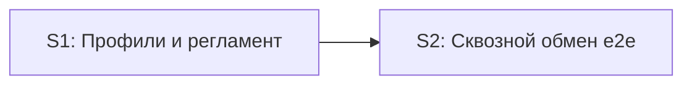

# Quality Control — Slice Coherence

**Change:** `universal-xml-exchange`  
**Date:** 2026-06-22  
**Mode:** slice (обнаружены `# Срез S1`, `# Срез S2`)  
**Tier:** Full (27 задач, 2 среза с независимыми outcomes)

---

## Verdict

**OK**

---

## Slice Summary

| Slice | Scenario | Tasks | Acceptance | Dependencies | Gate |
|---|---|---|---|---|---|
| S1 «Профили обмена и регламентные задания» | Администратор создаёт/редактирует профиль обмена; пароль в БСП; управление регламентом | S1.1–S1.10 (10) | S1.accept (1 mandatory Primary + 2 «включено в Primary» + 3 optional ≈ 5/5 spec-сценариев среза) | нет | `<!-- slice-gate -->` ✓ |
| S2 «Сквозной обмен данными» | Оператор запускает обмен на приёмнике; источник отдаёт ZIP через GetData; приёмник загружает V8Exch82 | S2.1–S2.15 (15) | S2.accept (1 mandatory Primary + 5 optional; остальные 9 spec-сценариев — в S2.6–S2.15) | S1 | `<!-- slice-gate -->` ✓ |

---

## Scenario Coverage

| Scenario | Capability | Covered by | Status |
|---|---|---|---|
| Создание профиля с обязательными реквизитами | exchange-settings | S1.accept Primary; S1.1, S1.7, S1.10 | ✓ |
| Запись пароля при сохранении профиля | exchange-settings | S1.accept Primary; S1.7, S1.10 | ✓ |
| Настройка параметров фильтрации | exchange-settings | S1.accept optional; S1.2, S1.10 | ✓ |
| Включение регламентного обмена | exchange-settings | S1.accept optional; S1.9, S1.10 | ✓ |
| Отключение регламентного обмена | exchange-settings | S1.accept optional; S1.9 | ✓ |
| Использование пароля при обмене | exchange-settings | S2.accept Primary; S2.10, S2.11 | ✓ |
| Публикация сервиса | exchange-web-service | S2.accept optional; S2.4 | ✓ |
| Успешный вызов GetData | exchange-web-service | S2.8; S2.accept Primary (e2e) | ✓ |
| Передача параметров фильтрации | exchange-web-service | S2.accept optional; S2.6, S2.10, S2.11 | ✓ |
| Загрузка правил из макета | exchange-export | S2.6 | ✓ |
| Подстановка параметров перед выгрузкой | exchange-export | S2.6 | ✓ |
| Полная выгрузка по правилам | exchange-export | S2.6 | ✓ |
| Примитивный параметр без обработчика в правилах | exchange-export | S2.9 (static «верифицировать по коду») | ✓ |
| Сжатие выгрузки | exchange-export | S2.7 | ✓ |
| Ручной запуск обмена | exchange-import | S2.accept Primary; S2.15 | ✓ |
| Регламентный запуск | exchange-import | S2.accept optional; S2.14 | ✓ |
| Подготовка сеанса по профилю | exchange-import | S2.10 | ✓ |
| Успешный запрос данных | exchange-import | S2.11; S2.accept Primary (e2e) | ✓ |
| Загрузка после получения архива | exchange-import | S2.12; S2.accept Primary (e2e) | ✓ |
| Недоступность веб-сервиса | exchange-import | S2.accept optional; S2.13 | ✓ |

**Итого:** 20/20 сценариев покрыты (Primary, optional accept или agent-задачи `S<N>.<M>`).

---

## Dependency Graph

**Внутри S1 (undeclared в metadata, но явно в тексте):**

- S1.5 → S1.8: регламентное задание ссылается на `ВыполнитьОбменПоПрофилю` до создания процедуры в BSL (допустимо для ручного конфигурирования; порядок apply — S1.8 перед S1.9).
- S1.8 → S2.14: stub регламентного обработчика дополняется полным сеансом в S2.

**Между срезами:** S2 объявляет `**Зависимости:** S1` — соответствует графу. Циклов нет. Forward-зависимостей S1 от S2 нет.

---

## Checklist Evaluation

| # | Критерий | Результат |
|---|---|---|
| 1 | Scenario Coverage | PASS — все 20 Scenario покрыты |
| 2 | Slice Independence | PASS — S1 принимается без S2 |
| 3 | Slice Completeness | PASS — оба среза содержат метаданные, BSL, формы, accept |
| 4 | Slice Dependency Graph | PASS — зависимости объявлены, циклов нет |
| 5 | Slice Gate Integrity | PASS — по одному `S<N>.accept` и `<!-- slice-gate -->` на срез |
| 5b | Acceptance Checklist Coverage | PASS — Primary в metadata и mandatory sub-bullet в обоих accept |
| 6 | Rework Risk | PASS (minor note — см. SUGGESTION) |
| 8 | Slice Verticality | PASS — Primary обоих срезов описывает black-box user-journey |
| 9 | Foundation slice with gate | PASS — S1 не programmatic-only gate; самостоятельный outcome «профиль + пароль + регламент» |
| 10 | Acceptance Simplicity | PASS — один mandatory journey на срез |
| 11 | User Task Contract | PASS — DENY-паттернов в `S<N>.<M>` нет; static-задачи помечены «верифицировать по коду» |
| 7 | Task Readability | PASS — формулировки следуют паттерну «глагол + объект/модуль + результат» |

---

## Alerts

### SUGGESTION

#### 1. `task-ordering-forward-ref` (внутри S1)

- **Affected:** S1.5, S1.8
- **Severity:** SUGGESTION
- **Evidence:** S1.5 (строка 15) создаёт регламентное задание с методом `ргУниверсальныйОбменXMLСервер.ВыполнитьОбменПоПрофилю` и пометкой «зависит от S1.8», но нумеруется до S1.8.
- **Recommendation:** При apply выполнять S1.8 до S1.9; для S1.5 ручное конфигурирование допустимо до BSL. Опционально переставить S1.5 после S1.8 в tasks.md для согласованности нумерации с порядком apply.

#### 2. `spec-link-traceability` (метаданные S2)

- **Affected:** S2 metadata `**Связь со spec:**`
- **Severity:** SUGGESTION
- **Evidence:** S1 перечисляет Scenario поимённо (5 шт.); S2 ссылается на capabilities целиком (`exchange-web-service`, `exchange-export`, `exchange-import`). Покрытие полное (см. таблицу Scenario Coverage), но трассировка из metadata среза к accept/задачам слабее, чем в S1 и матрице design.md § Slices.
- **Recommendation:** Дополнить `**Связь со spec:**` S2 перечислением Scenario (как в design.md «Матрица приёмки») — улучшит читаемость без изменения scope.

#### 3. `accept-clarification-bullets` (S1.accept)

- **Affected:** S1.accept
- **Severity:** SUGGESTION
- **Evidence:** Два sub-bullet с пометкой «(включено в Primary)» дублируют mandatory Primary, не помечены «опционально».
- **Recommendation:** Оставить как есть (не блокирует) или свернуть в одну строку Primary для компактности чеклиста.

---

## Task Readability (критерий 7)

| Task | Оценка | Комментарий |
|---|---|---|
| S1.1–S1.5 | OK | Ручное конфигурирование с объектом, реквизитами и ссылкой на spec |
| S1.6, S2.5 | OK | Выгрузка с перечислением артефактов и целевого каталога |
| S1.7–S1.10 | OK | Модуль + поведение + бизнес-результат + spec |
| S2.1–S2.4 | OK | Аналогично |
| S2.6–S2.15 | OK | Экспортные точки и контракты явно названы |
| S2.9 | OK | Agent static verification — допустимый паттерн |
| S1.accept, S2.accept | OK | Бизнес-результат в заголовке; Primary mandatory присутствует |

Алертов `task-opaque-title`, `task-too-short`, `task-opaque-acceptance` не выявлено.

---

## Recommendations

### Automatic fix (не требуется для verdict OK)

Нет CRITICAL/WARNING с auto-repair.

### Decision required (опционально)

| # | Тема | Варианты |
|---|---|---|
| 1 | Порядок S1.5 vs S1.8 | A — оставить (apply-order явен); B — перенумеровать S1.5 после S1.8 |
| 2 | Детализация `**Связь со spec:**` S2 | A — оставить ссылку на capabilities; B — перечислить 15 Scenario поимённо |

---

## Context Notes (из prompt verify)

- **Manual config:** маркеры «Ручное конфигурирование» в S1.1–S1.5, S2.1–S2.4; детали имён/типов в тексте задач и design.md D4 / Behavior Contract.
- **Repository state:** расширение — skeleton; целевые объекты ещё не созданы (ожидаемо pre-apply).
- **Code-truth (вне scope QC):** phantom symbols для новых объектов расширения — ожидаемо до apply.

---

## Summary

Декомпозиция согласована с design.md § Slices: S1 — самостоятельная приёмка профилей и регламента; S2 — end-to-end обмен с зависимостью от S1. Все 20 Scenario из delta specs покрыты. Gate-целостность, Primary acceptance, вертикальность приёмки и User Task Contract соблюдены. Блокеров для pre-apply verify по slice coherence нет.
