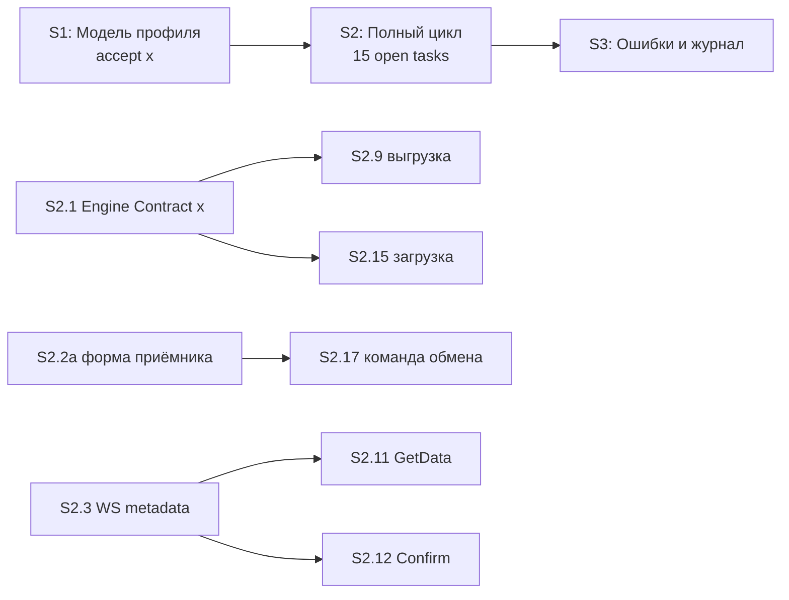

# Quality Control — Slice Coherence (incremental)

**Change:** universal-xml-exchange2  
**Date:** 2026-06-25  
**Mode:** slice (3 slices: S1, S2, S3)  
**Verify depth:** incremental — post-extend 2026-06-25; S1 принят `[x]`; фокус S2  
**Tier:** Full (S1: 12 impl + accept; S2: 17 impl + accept; S3: 6 impl + accept)

---

## Verdict

**OK**

Критических нарушений slice coherence не выявлено. Срез S2 после extend (встроенный движок `рг_УниверсальныйОбменДаннымиXML`) остаётся вертикально согласованным, покрывает все заявленные Scenario, готов к `/opsx:apply` при условии завершения открытых задач S2.

---

## Slice Summary

| Slice | Scenario | Tasks | Acceptance | Dependencies | Gate |
|-------|----------|-------|------------|--------------|------|
| S1 | Модель профиля и статусы | S1.1–S1.12 (12, все `[x]`) | S1.accept `[x]` (Primary + 5 included + 4 optional ≈ 10/10) | нет | `<!-- slice-gate -->` ✓ |
| S2 | Полный цикл обмена | S2.1–S2.17 (17; `[x]` S2.1–S2.2, S2.4 cancelled; открыто 15) | S2.accept (Primary + 5 included + 9 optional = 15/15) | S1 `[x]` | `<!-- slice-gate -->` ✓ |
| S3 | Ошибки и журнал | S3.1–S3.6 (6, все `[ ]`) | S3.accept (Primary + 2 included + 2 optional = 4/4 в metadata; +1 scenario в S3.4) | S2 | `<!-- slice-gate -->` ✓ |

**Примечание extend 2026-06-25:** S2.2 — as-built встроенная обработка; S2.4 снята; S2.1 verified по cf + cfe; `rgExchangeService` в src отсутствует (ожидаемо до S2.3).

---

## Scenario Coverage

Всего `#### Scenario:` в delta specs: **27**. Покрытие — Primary, optional sub-bullet в `S<N>.accept` или задача `S<N>.<M>`.

| Scenario | Capability | Covered by | Status |
|----------|------------|------------|--------|
| Профиль источника | exchange-settings | S1.accept (included in Primary) | ✓ |
| Профиль приёмника | exchange-settings | S1.accept (included in Primary) | ✓ |
| Настройка префиксов | exchange-settings | S1.accept (optional) | ✓ |
| Ручная инициация обмена | exchange-settings | S1.accept (optional) | ✓ |
| Завершение обмена | exchange-settings | S2.accept (included in Primary) | ✓ |
| Загрузка правил пользователем | exchange-settings | S1.10, S1.accept (optional) | ✓ |
| Проверка при записи источника | exchange-settings | S1.6, S1.accept (included in Primary) | ✓ |
| Создание профиля приёмника | exchange-settings | S1.7, S1.accept (included in Primary) | ✓ |
| Создание профиля источника | exchange-settings | S1.accept (included in Primary) | ✓ |
| Настройка параметров на источнике | exchange-settings | S1.accept (optional) | ✓ |
| Успешный цикл с подтверждением | exchange-import | S2.16, S2.accept (included in Primary) | ✓ |
| Ошибка загрузки без подтверждения | exchange-import | S3.6, S3.accept (optional) | ✓ |
| Подготовка сеанса по профилю приёмника | exchange-import | S2.13, S2.accept (optional) | ✓ |
| Успешный запрос данных | exchange-import | S2.14, S2.accept (optional) | ✓ |
| Загрузка после получения архива | exchange-import | S2.15, S2.17, S2.accept (optional) | ✓ |
| Выгрузка с правилами из профиля | exchange-export | S2.9, S2.accept (optional) | ✓ |
| Ошибка выгрузки | exchange-export | S3.2, S3.accept (included in Primary) | ✓ |
| Запуск встроенного движка | exchange-export | S2.9, S2.accept (optional) | ✓ |
| Подстановка параметров перед выгрузкой | exchange-export | S2.9, S2.accept (optional) | ✓ |
| Состав архива | exchange-export | S2.10, S2.accept (optional) | ✓ |
| Успешное подтверждение | exchange-web-service | S2.12, S2.accept (included in Primary) | ✓ |
| Подтверждение при неверном статусе | exchange-web-service | S3.4, S3.accept (optional) | ✓ |
| Повторное подтверждение после успешного завершения | exchange-web-service | S3.4 (agent impl) | ✓ |
| Поиск профиля по префиксам | exchange-web-service | S2.7, S2.accept (included in Primary) | ✓ |
| Успешный вызов GetData из статуса Новое | exchange-web-service | S2.8–S2.11, S2.accept (included in Primary) | ✓ |
| Отклонение GetData при другом статусе | exchange-web-service | S3.1, S3.accept (included in Primary) | ✓ |
| Использование параметров профиля | exchange-web-service | S2.9, S2.accept (optional) | ✓ |

**Design-only invariant** («профиль не найден / >1 по префиксам») покрыт S3.3; отдельного Scenario в spec нет — допустимо.

---

## Dependency Graph

- Межсрезовые зависимости объявлены: S2 ← S1 (`[x]`), S3 ← S2.
- Внутри S2: S2.1 блокирует S2.9, S2.15 (явно в тексте); S2.2a → S2.17, S2.5; S2.3 → S2.11, S2.12 — логический порядок в группах, циклов нет.
- Forward-undeclared межсрезовых зависимостей нет.

---

## Incremental S2 Focus (post-extend)

| Критерий | S2 оценка | Evidence |
|----------|-----------|----------|
| Scenario Coverage | ✓ | 15 Scenario из metadata S2 покрыты Primary/optional/tasks |
| Slice Independence | ✓ | S1 принят; S3 не требуется для приёмки S2 |
| Slice Completeness | ✓ | static (S2.1), metadata (S2.2a–S2.6), BSL export (S2.7–S2.12), BSL import (S2.13–S2.17), accept |
| Gate Integrity | ✓ | один S2.accept + slice-gate |
| Primary + checklist | ✓ | `**Primary acceptance:**` в metadata; mandatory sub-bullet в S2.accept |
| Verticality | ✓ | Primary — end-to-end black-box (обработка → обмен → данные + «Выполнено») |
| Foundation+gate | ✓ | S1 — самостоятельный UX-outcome, не programmatic-only gate |
| Acceptance Simplicity | ✓ | один mandatory Primary journey |
| User Task Contract | ✓ | DENY grep по S2.7–S2.17: нет user runtime-spike; S2.1 — static agent |
| Task Readability | ✓ | открытые задачи следуют паттерну глагол + объект + результат |

**Repository alignment (informational, out of QC blocking scope):** `рг_УниверсальныйОбменДаннымиXML` и `рг_УниверсальныйОбменXMLСервер` в cfe — есть; `rgExchangeService` — ожидаемо после S2.3.

---

## Alerts

### SUGGESTION

#### task-id-letter-suffix

- **Affected:** S2.2a
- **Severity:** SUGGESTION
- **Evidence:** ID задачи `S2.2a` использует буквенный суффикс между S2.2 и S2.3; канонический формат — `S<N>.<M>` с числовым M.
- **Recommendation:** при следующем `/opsx:extend` перенумеровать (например S2.2a → S2.3 со сдвигом последующих) или оставить как есть, если ID уже зафиксирован в handoff/debug — не блокирует apply.

#### metadata-scenario-gap-s3

- **Affected:** S3 metadata `**Связь со spec:**`
- **Severity:** SUGGESTION
- **Evidence:** Scenario «Повторное подтверждение после успешного завершения» реализуется в S3.4, но не перечислен в metadata S3.
- **Recommendation:** добавить Scenario в `**Связь со spec:**` S3 и optional bullet в S3.accept для трассируемости (не блокирует — покрытие через S3.4 OK).

#### ws-publication-prerequisite

- **Affected:** S2 Primary acceptance
- **Severity:** SUGGESTION
- **Evidence:** Primary требует «на источнике опубликован `rgExchangeService`»; S2.3 создаёт метаданные WS, публикация на сервере 1С — только в design § Manual Configuration, без отдельной строки tasks.
- **Recommendation:** при handoff на приёмку S2 явно включить шаг публикации WS (как prerequisite acceptance, аналогично S1 «развёрнутое расширение»).

#### task-readability — none

Открытые задачи S2 (S2.2a–S2.17) соответствуют паттерну task-readability; алертов `task-opaque-title` / `task-too-short` нет.

---

## Recommendations

### Automatic fix (optional)

| Alert | Action |
|-------|--------|
| metadata-scenario-gap-s3 | В metadata S3 добавить Scenario «Повторное подтверждение после успешного завершения»; optional bullet в S3.accept |

### Decision required

| Alert | Action |
|-------|--------|
| task-id-letter-suffix | Оставить S2.2a или перенумеровать — только при конфликте с tooling/handoff |

---

## Checklist Summary (criteria 1–11)

| # | Criterion | Result |
|---|-----------|--------|
| 1 | Scenario Coverage | PASS — 27/27 |
| 2 | Slice Independence | PASS |
| 3 | Slice Completeness | PASS (S2: все слои для e2e) |
| 4 | Dependency Graph | PASS — без циклов |
| 5 | Slice Gate Integrity | PASS — 3/3 accept + gate |
| 5b | Acceptance Checklist Coverage | PASS — Primary present во всех срезах |
| 6 | Rework Risk | PASS — S2.1 `[x]`, S1 `[x]`, нет дублирующих primary outcomes |
| 8 | Slice Verticality | PASS — Primary black-box во всех срезах |
| 9 | Foundation slice with gate | PASS — S1 не foundation-only |
| 10 | Acceptance Simplicity | PASS — один mandatory journey на срез |
| 11 | User Task Contract | PASS — pre-check и QC: нарушений нет |
| 7 | Task Readability | PASS |

---

## Context Notes (extend 2026-06-25)

- Движок: Option B (встроенная `рг_УниверсальныйОбменДаннымиXML`); S2.4 cancelled; spec/tasks/design согласованы.
- Manual config checklist (verify 5.1): WS GetData/Confirm — S2.3; форма обработки — S2.2a; роль — S2.6.
- User Task Contract pre-check (Layers 1–3): none.
