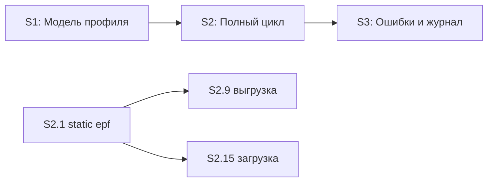

# Quality Control — Slice Coherence

**Change:** universal-xml-exchange2  
**Date:** 2026-06-25  
**Mode:** slice (3 slices: S1, S2, S3)  
**Tier:** Full (33 implementation tasks + 3 accept)

---

## Verdict

**OK**

Критических нарушений slice coherence не выявлено. План исполним; срезы независимо принимаемы по цепочке S1 → S2 → S3.

**Orchestrator summary:** PASS — critical issues: _(none)_

---

## Slice Summary

| Slice | Scenario | Tasks | Acceptance | Dependencies | Gate |
|-------|----------|-------|------------|--------------|------|
| S1 | Модель профиля и статусы | S1.1–S1.10 (10) | S1.accept (Primary + 5 included + 4 optional = 10/10 spec scenarios) | нет | `<!-- slice-gate -->` ✓ |
| S2 | Полный цикл обмена | S2.1–S2.17 (17) | S2.accept (Primary + 5 included + 9 optional = 15/15 spec scenarios) | S1 | `<!-- slice-gate -->` ✓ |
| S3 | Ошибки и журнал | S3.1–S3.6 (6) | S3.accept (Primary + 2 included + 2 optional = 4/4 spec scenarios) | S2 | `<!-- slice-gate -->` ✓ |

---

## Scenario Coverage

Всего `#### Scenario:` в delta specs: **26**. Покрытие — Primary, optional sub-bullet в `S<N>.accept` или задача `S<N>.<M>`.

| Scenario | Capability | Covered by | Status |
|----------|------------|------------|--------|
| Профиль источника | exchange-settings | S1.accept (included in Primary) | ✓ |
| Профиль приёмника | exchange-settings | S1.accept (included in Primary) | ✓ |
| Настройка префиксов | exchange-settings | S1.accept (optional) | ✓ |
| Ручная инициация обмена | exchange-settings | S1.accept (optional) | ✓ |
| Завершение обмена | exchange-settings | S2.accept (included in Primary) | ✓ |
| Загрузка правил пользователем | exchange-settings | S1.10, S1.accept (optional) | ✓ |
| Проверка при записи источника | exchange-settings | S1.6, S1.accept (included in Primary) | ✓ |
| Создание профиля приёмника | exchange-settings | S1.7, S1.accept (included in Primary) | ✓ |
| Создание профиля источника | exchange-settings | S1.accept (included in Primary) | ✓ |
| Настройка параметров на источнике | exchange-settings | S1.accept (optional) | ✓ |
| Успешный цикл с подтверждением | exchange-import | S2.16, S2.accept (included in Primary) | ✓ |
| Ошибка загрузки без подтверждения | exchange-import | S3.6, S3.accept (optional) | ✓ |
| Подготовка сеанса по профилю приёмника | exchange-import | S2.13, S2.accept (optional) | ✓ |
| Успешный запрос данных | exchange-import | S2.14, S2.accept (optional) | ✓ |
| Загрузка после получения архива | exchange-import | S2.15, S2.accept (optional) | ✓ |
| Выгрузка с правилами из профиля | exchange-export | S2.9, S2.accept (optional) | ✓ |
| Ошибка выгрузки | exchange-export | S3.2, S3.accept (included in Primary) | ✓ |
| Запуск движка epf | exchange-export | S2.9, S2.accept (optional) | ✓ |
| Подстановка параметров перед выгрузкой | exchange-export | S2.9, S2.accept (optional) | ✓ |
| Состав архива | exchange-export | S2.10, S2.accept (optional) | ✓ |
| Успешное подтверждение | exchange-web-service | S2.12, S2.accept (included in Primary) | ✓ |
| Подтверждение при неверном статусе | exchange-web-service | S3.4, S3.accept (optional) | ✓ |
| Поиск профиля по префиксам | exchange-web-service | S2.7, S2.accept (included in Primary) | ✓ |
| Успешный вызов GetData из статуса Новое | exchange-web-service | S2.8–S2.11, S2.accept (included in Primary) | ✓ |
| Отклонение GetData при другом статусе | exchange-web-service | S3.1, S3.accept (included in Primary) | ✓ |
| Использование параметров профиля | exchange-web-service | S2.9, S2.accept (optional) | ✓ |

**Design-only invariant** («профиль не найден / >1 по префиксам») покрыт задачей S3.3; отдельного Scenario в spec нет — допустимо.

---

## Dependency Graph

- Межсрезовые зависимости объявлены в metadata: S2 ← S1, S3 ← S2.
- Внутри S2: S2.1 явно блокирует S2.9 и S2.15 (текст задачи).
- Циклов и forward-undeclared зависимостей нет.

---

## User Task Contract Pre-check

Mechanical grep по `tasks.md` (строки `S<N>.<M>`, не accept/Follow-up):

| Pattern | Result |
|---------|--------|
| DENY: тестовой ИБ, отладчик, консоль, runtime-verify, спайк, «после стенда» | **Not found** |
| ALLOW: S1.1–S1.5, S2.2–S2.6, S2.4 — «Ручное конфигурирование» / Конфигуратор / администрирование | **Present, compliant** |
| ALLOW-agent: S2.1 «Верифицировать по коду/макету» | **Agent task, not user spike** |

**Criterion 11:** no violations.

---

## Checklist Evaluation (criteria 1–6, 8–11)

| # | Criterion | Result | Notes |
|---|-----------|--------|-------|
| 1 | Scenario Coverage | **Pass** | 26/26 spec scenarios covered |
| 2 | Slice Independence | **Pass** | S3 принимаем без S4+; каждый срез принимаем после дедов |
| 3 | Slice Completeness | **Pass** | S1: метаданные + BSL + форма; S2: epf gate + WS + export/import + форма; S3: отказные пути BSL |
| 4 | Slice Dependency Graph | **Pass** | Линейная цепочка, metadata согласована с design § Slices |
| 5 | Slice Gate Integrity | **Pass** | Ровно один `S<N>.accept` и один `<!-- slice-gate -->` на срез |
| 5b | Acceptance Checklist Coverage | **Pass** | `**Primary acceptance:**` и `**Primary (обязательно):**` во всех срезах; чеклисты не пусты |
| 6 | Rework Risk | **Pass** | Зависимости явные; дублирования сценариев между срезами нет (S2 happy / S3 negative — слоисто) |
| 8 | Slice Verticality | **Pass** | Primary во всех срезах — black-box (профили, e2e обмен, отказные пути + журнал) |
| 9 | Foundation slice with gate | **Pass** | S1 даёт самостоятельный UX-outcome (модель профиля), не programmatic-only foundation |
| 10 | Acceptance Simplicity | **Pass** | Один mandatory Primary sub-bullet на срез; S3 Primary — одна сессия проверки отказных путей |
| 11 | User Task Contract | **Pass** | См. pre-check выше |
| 7 | Task Readability | **Pass** | См. раздел ниже |

---

## Task Readability

Формулировки задач следуют паттерну «глагол + файл/объект + бизнес-результат + (ссылка)». Prerequisites (S1.4, S2.5 — выгрузка XML) содержат целевой путь и артефакт.

Алертов `task-opaque-title`, `task-too-short`, `task-opaque-acceptance` не выявлено.

---

## Alerts

### CRITICAL

_(none)_

### WARNING

_(none)_

### SUGGESTION

#### S3 — optional accept для design-инварианта «профиль не найден»

- **Slice/task:** S3 / S3.3
- **Severity:** SUGGESTION
- **Evidence:** S3.3 реализует поведение из design Behavior Contract («профиль не найден / >1»), но в `S3.accept` нет optional sub-bullet; приёмка полагается на реализацию без явного пользовательского шага.
- **Recommendation:** При желании усилить observability — добавить optional sub-bullet в `S3.accept`: «вызвать GetData с несуществующей парой префиксов → ошибка, статусы профилей не меняются». Не блокирует verify/apply.

---

## Recommendations

### Automatic fix

Не требуется — CRITICAL/WARNING алертов нет.

### Decision required

Не требуется.

### Optional (SUGGESTION)

- Рассмотреть optional sub-bullet в S3.accept для сценария «профиль не найден / дубли префиксов на источнике» (design invariant, задача S3.3).

---

## Cross-check with design § Slices

| design § Slices | tasks.md | Match |
|-----------------|----------|-------|
| S1 — модель профиля, Primary: профили + «Новое» | S1 metadata + accept | ✓ |
| S2 — полный цикл, Primary: e2e обмен → «Выполнено» | S2 metadata + accept | ✓ |
| S3 — ошибки и журнал, Primary: отказ GetData + ошибка выгрузки | S3 metadata + accept | ✓ |
| Матрица capability ●/○ | Распределение задач по срезам | ✓ |

---

## Sources

- `openspec/changes/universal-xml-exchange2/tasks.md`
- `openspec/changes/universal-xml-exchange2/design.md`
- `openspec/changes/universal-xml-exchange2/proposal.md`
- `openspec/changes/universal-xml-exchange2/specs/**/spec.md`
- `.cursor/rules/vertical-slices.mdc`
- `.cursor/rules/task-readability.mdc`
