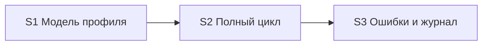

# Quality Control — Slice Coherence

**Change:** universal-xml-exchange2  
**Date:** 2026-06-26  
**Mode:** slice (3 среза `# Срез S<N>`)  
**Context:** verify after repair — добавлены S3.7, design § UX ошибок WS, spec scenario «Понятное сообщение об ошибке веб-сервиса»

---

## Verdict

`OK`

---

## Slice Summary

| Slice | Scenario | Tasks | Acceptance | Dependencies | Gate |
|---|---|---|---|---|---|
| S1 | Модель профиля и статусы (источник/приёмник, префиксы, правила, статус) | S1.1–S1.12 (12) | S1.accept (9 spec bullets: 1 Primary + 5 «включено в Primary» + 4 optional) | нет | `<!-- slice-gate -->` ✓ |
| S2 | Полный цикл GetData → загрузка → Confirm | S2.1–S2.17 (17) | S2.accept (13 spec bullets: 1 Primary + 5 «включено в Primary» + 7 optional) | S1 | `<!-- slice-gate -->` ✓ |
| S3 | Ошибки, журнал, UX сообщений WS | S3.1–S3.7 (7; S3.7 `[ ]`) | S3.accept (6 spec bullets: 1 Primary + 3 «включено в Primary» + 2 optional; `[ ]`) | S2 | `<!-- slice-gate -->` ✓ |

---

## Scenario Coverage

| Scenario | Covered by | Status |
|---|---|---|
| Профиль источника | S1.accept Primary | ✓ |
| Профиль приёмника | S1.accept Primary | ✓ |
| Настройка префиксов | S1.accept optional | ✓ |
| Ручная инициация обмена | S1.accept optional | ✓ |
| Завершение обмена | S2.accept Primary | ✓ |
| Загрузка правил пользователем | S1.accept optional | ✓ |
| Проверка при записи источника | S1.accept Primary | ✓ |
| Создание профиля приёмника | S1.accept Primary | ✓ |
| Создание профиля источника | S1.accept Primary | ✓ |
| Настройка параметров на источнике | S1.accept optional | ✓ |
| Успешное подтверждение | S2.accept Primary | ✓ |
| Подтверждение при неверном статусе | S3.4, S3.accept optional | ✓ |
| Повторное подтверждение после успешного завершения | S3.4 (agent static) | ✓ |
| Поиск профиля по префиксам | S2.accept Primary, S3.3 | ✓ |
| Успешный вызов GetData из статуса Новое | S2.accept Primary | ✓ |
| Отклонение GetData при другом статусе | S3.accept Primary | ✓ |
| Использование параметров профиля | S2.accept optional | ✓ |
| Выгрузка с правилами из профиля | S2.accept optional | ✓ |
| Ошибка выгрузки | S3.accept Primary | ✓ |
| Запуск встроенного движка | S2.accept optional | ✓ |
| Подстановка параметров перед выгрузкой | S2.accept optional | ✓ |
| Состав архива | S2.accept optional | ✓ |
| Успешный цикл с подтверждением | S2.accept Primary | ✓ |
| Ошибка загрузки без подтверждения | S3.6, S3.accept optional | ✓ |
| Понятное сообщение об ошибке веб-сервиса | S3.7, S3.accept «включено в Primary» | ✓ (impl pending S3.7) |
| Подготовка сеанса по профилю приёмника | S2.accept optional | ✓ |
| Успешный запрос данных | S2.accept optional | ✓ |
| Загрузка после получения архива | S2.accept optional | ✓ |

Все 25 `#### Scenario:` из delta specs покрыты.

---

## Dependency Graph

- Зависимости объявлены в метаданных: S2 → S1, S3 → S2.
- Циклов и forward-зависимостей нет.
- Необъявленных slice-to-slice зависимостей не найдено.

---

## Alerts

### SUGGESTION — primary-metadata-drift (S3)

- **Affected:** S3 metadata `**Primary acceptance:**`
- **Severity:** SUGGESTION
- **Evidence:** После repair scenario «Понятное сообщение об ошибке веб-сервиса» добавлен в `**Связь со spec:**`, `S3.accept` (буллет «включено в Primary») и `S3.7`; поле `**Primary acceptance:**` в метаданных S3 описывает только отказ GetData и ошибку выгрузки, без UX-проверки формы приёмника.
- **Recommendation:** Дополнить `**Primary acceptance:**` третьим шагом (форма обработки показывает краткий текст WS-ошибки без стека) **или** перенести буллет в optional, если UX проверяется только как часть первого шага Primary.

### SUGGESTION — task-readability (S2.4)

- **Affected:** S2.4
- **Severity:** SUGGESTION
- **Evidence:** Задача зачёркнута (`~~…~~`) и помечена «не требуется» — формально остаётся в списке с `[x]`.
- **Recommendation:** При следующем extend удалить строку или заменить на однострочную заметку в design (не блокирует apply).

---

## Recommendations

### Automatic fix (optional, не блокирует verify)

| Alert | Action |
|---|---|
| primary-metadata-drift | В `tasks.md` S3 metadata: расширить `**Primary acceptance:**` — «…→ на форме обработки приёмника краткий текст ошибки без стека вызовов» |

### Decision required

Нет.

---

## Task Readability (criterion 7)

| Check | Result |
|---|---|
| `task-opaque-title` | Не найдено |
| `task-too-short` | Не найдено |
| `task-opaque-acceptance` | Не применимо (`S<N>.accept`, не legacy `T<M>`) |
| `accept-checklist-empty` | Нет (все три среза имеют Primary sub-bullet) |
| `accept-bullet-foreign-scenario` | Нет |
| `legacy-acceptance-format` | Нет |

Задачи S1–S3 следуют паттерну «глагол + файл/процедура + бизнес-результат + (ссылка)». S3.7 — читаемая, с явными процедурами и критерием UX.

---

## Checklist Summary (criteria 1–11)

| Criterion | Result |
|---|---|
| 1 Scenario Coverage | PASS — 25/25 |
| 2 Slice Independence | PASS |
| 3 Slice Completeness | PASS |
| 4 Dependency Graph | PASS |
| 5 Slice Gate Integrity | PASS — 3 accept + 3 slice-gate |
| 5b Acceptance Checklist | PASS |
| 6 Rework Risk | PASS — линейная цепочка, без дублирования outcomes |
| 8 Slice Verticality | PASS — Primary black-box во всех срезах |
| 9 Foundation + gate | PASS — S1 не programmatic-only foundation |
| 10 Acceptance Simplicity | PASS — один blocking Primary sub-bullet на срез; «включено в Primary» = декомпозиция, не отдельные gate |
| 11 User Task Contract | PASS — S3.7 BSL-only; grep DENY без совпадений в `S<N>.<M>` |

---

## Implementation State Note (out of scope для structural QC)

- S3.7 и S3.accept — `[ ]` (ожидаемо после repair до apply).
- Репозиторий: `ВызватьGetDataНаИсточнике`, `ВыполнитьСеансОбменаПоПрофилюПриемника` — существуют (pre-check контекста verify).
