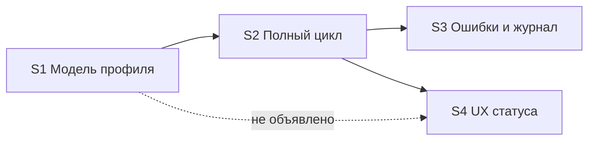

# Quality Control — Slice Coherence

**Change:** universal-xml-exchange2  
**Date:** 2026-06-29  
**Mode:** slice (4 среза `# Срез S<N>`)  
**Context:** extend 2026-06-29 — добавлен S4 «UX статуса источника»; фокус согласованности S4 с S1–S3

---

## Verdict

`WARNING`

---

## Criteria Summary

| # | Criterion | Verdict | Notes |
|---|-----------|---------|-------|
| 1 | Scenario Coverage | **PASS** | 28 `#### Scenario:` покрыты (25 прежних + 3 новых S4) |
| 2 | Slice Independence | **WARNING** | S4 принимаем без S3; параллельная правка `рг_УниверсальныйОбменXMLСервер` |
| 3 | Slice Completeness | **PASS** | S4: метаданные, BSL сервер/форма/объект, accept |
| 4 | Slice Dependency Graph | **WARNING** | S4 → S2 объявлено; S4 → S1 не объявлено |
| 5 | Slice Gate Integrity | **PASS** | По одному `S<N>.accept` и `<!-- slice-gate -->` на срез |
| 5b | Acceptance Checklist Coverage | **PASS** | Primary в metadata и accept для S1–S4 |
| 6 | Rework Risk | **WARNING** | Enum→string после принятого S1; S3 `[ ]` accept при готовом коде S3.1–S3.7 |
| 7 | Task Readability | **PASS** | 1 SUGGESTION по S4.7 |
| 8 | Slice Verticality | **PASS** | Primary — black-box во всех срезах |
| 9 | Foundation slice with gate | **PASS** | Ложных foundation-gate нет |
| 10 | Acceptance Simplicity | **PASS** | Один mandatory journey на срез |
| 11 | User Task Contract | **PASS** | Grep S4.* — нарушений нет; ИБ только в accept |

---

## Slice Summary

| Slice | Scenario | Tasks | Acceptance | Dependencies | Gate |
|---|---|---|---|---|---|
| S1 | Модель профиля и статусы | S1.1–S1.12 (12, `[x]`) | S1.accept (1 Primary + 8 optional/включено; `[x]`) | нет | ✓ |
| S2 | Полный цикл GetData → Confirm | S2.1–S2.17 (17, `[x]`) | S2.accept (1 Primary + 12 optional/включено; `[x]`) | S1 | ✓ |
| S3 | Ошибки и журнал | S3.1–S3.7 (7, `[x]`) | S3.accept (1 Primary + 5 optional/включено; `[ ]`) | S2 | ✓ |
| S4 | UX статуса источника | S4.1–S4.8 (8, `[ ]`) | S4.accept (1 Primary + 3 spec + 1 optional; `[ ]`) | S2 *(см. алерт)* | ✓ |

**S4.accept:** 3/3 Scenario из `**Связь со spec:**` + optional «Прямое редактирование…».

---

## Scenario Coverage

| Scenario | Covered by | Status |
|---|---|---|
| Профиль источника | S1.accept Primary | ✓ |
| Профиль приёмника | S1.accept Primary | ✓ |
| Настройка префиксов | S1.accept optional | ✓ |
| Ручная инициация обмена | S1.accept optional *(legacy UX; S4 заменяет кнопкой)* | ✓ |
| Завершение обмена (ADDED) | S2.accept Primary | ✓ |
| Загрузка правил пользователем | S1.accept optional | ✓ |
| Проверка при записи источника | S1.accept Primary | ✓ |
| Создание профиля приёмника | S1.accept Primary | ✓ |
| Создание профиля источника | S1.accept Primary | ✓ |
| Настройка параметров на источнике | S1.accept optional | ✓ |
| **Подготовка к обмену кнопкой** | S4.accept Primary, S4.6 | ✓ |
| **Отмена подготовки** | S4.accept Primary (буллет), S4.6 | ✓ |
| **Подтверждение отмены зависшего сеанса** | S4.accept Primary, S4.7 | ✓ |
| Завершение обмена (MODIFIED) | S2.accept Primary | ✓ |
| Успешное подтверждение | S2.accept Primary | ✓ |
| Подтверждение при неверном статусе | S3.4, S3.accept optional | ✓ |
| Повторное подтверждение после успешного завершения | S3.4 (agent static) | ✓ |
| Поиск профиля по префиксам | S2.accept Primary, S3.3 | ✓ |
| Успешный вызов GetData из статуса Новое | S2.accept Primary | ✓ |
| Отклонение GetData при другом статусе | S3.accept Primary | ✓ |
| Использование параметров профиля | S2.accept optional | ✓ |
| Выгрузка с правилами из профиля | S2.accept optional | ✓ |
| Ошибка выгрузки | S3.accept Primary | ✓ |
| Запуск встроенного движка | S2.accept optional | ✓ |
| Подстановка параметров перед выгрузкой | S2.accept optional | ✓ |
| Состав архива | S2.accept optional | ✓ |
| Успешный цикл с подтверждением | S2.accept Primary | ✓ |
| Ошибка загрузки без подтверждения | S3.6, S3.accept optional | ✓ |
| Понятное сообщение об ошибке веб-сервиса | S3.7, S3.accept «включено в Primary» | ✓ |
| Подготовка сеанса по профилю приёмника | S2.accept optional | ✓ |
| Успешный запрос данных | S2.accept optional | ✓ |
| Загрузка после получения архива | S2.accept optional | ✓ |

Все 28 `#### Scenario:` из delta specs покрыты.

---

## Dependency Graph

- Объявлено: S2 → S1; S3 → S2; S4 → S2.
- Циклов нет.
- **Необъявленная:** S4 меняет `рг_НастройкиОбменаXML`, `ФормаЭлемента`, `ObjectModule.bsl` — объекты S1; транзитивно S4 требует принятого S1 (фактически `[x]`).
- S4 и S3 — **параллельные потомки S2**; S4 не зависит от S3, но S4.4 рефакторит тот же `рг_УниверсальныйОбменXMLСервер`, что и S3.1–S3.7.

**Рекомендуемый порядок apply:** S1 → S2 → **S3.accept** (или код S3 + accept) → **S4** — чтобы приёмка отказных путей не устарела после миграции enum→string. Альтернатива: S4 до S3.accept при условии повторной проверки S3 Primary после S4.4.

---

## S4 Coherence with S1–S3

| Аспект | Оценка |
|--------|--------|
| Семантика gate GetData/Confirm | **Согласовано** — коды `"Новое"` / `"Выполняется"` / … сохранены (design D1–D3); S4.4 явно рефакторит сравнения |
| UX vs S1 enum-модель | **Ожидаемый drift** — S1 принят с enum; S4 удаляет `рг_СтатусыОбмена`; migration plan в design § Migration Plan (S4) |
| Пересечение с S3 | **Риск rework** — S3.1–S3.7 `[x]` на enum; S4.4 меняет те же процедуры; S3.accept `[ ]` — окно для приёмки до/после S4 |
| Primary S4 vs S2 | **Допустимо** — S4 Primary включает end-to-end обмен как проверку «Подготовить к обмену»; не дублирует отдельный gate S2 (S2 уже `[x]`) |
| Spec MODIFIED | **Согласовано** — три новых Scenario только в S4 metadata и accept |

---

## Alerts

### WARNING — slice-dependency-undeclared (S4)

- **Slice/task:** S4 metadata `**Зависимости:**`
- **Severity:** WARNING
- **Evidence:** S4.1–S4.2, S4.5–S4.8 правят справочник и форму из S1; в метаданных только `S2`.
- **Recommendation:** Добавить `S1` в `**Зависимости:**` (транзитивно через S2 недостаточно для читателя tasks).

### Remediation (auto-repair)

- alert: slice-dependency-undeclared
- target: `tasks.md` — срез S4, блок метаданных
- action: заменить `**Зависимости:** S2` на `**Зависимости:** S1, S2` (или `S2` с примечанием «транзитивно S1» — предпочтительнее явный список).

---

### WARNING — rework-risk-parallel-slices (S3, S4)

- **Slice/task:** S3.1–S3.7, S4.4
- **Severity:** WARNING
- **Evidence:** Оба среза меняют `рг_УниверсальныйОбменXMLСервер`; S3 код выполнен под enum, S4.4 — миграция на строковые константы; S3.accept ещё `[ ]`.
- **Recommendation:** Зафиксировать в `debug.md` или комментарии к S4: после S4.4 повторить S3 Primary перед закрытием S3.accept; либо принять S3 до старта S4.

---

### WARNING — slice-independence-s3-before-s4-accept (S4)

- **Slice/task:** S4.accept Primary
- **Severity:** WARNING
- **Evidence:** S4 можно закрыть без S3.accept; отказные пути после S4.4 не входят в S4 Primary (только happy-path + кнопки).
- **Recommendation:** Не блокирует S4; при apply не считать S3 устаревшим без повторной приёмки Primary S3.

---

### SUGGESTION — task-too-short (S4.7)

- **Slice/task:** S4.7
- **Severity:** SUGGESTION
- **Evidence:** «В модуле формы» без полного пути `Catalogs/рг_НастройкиОбменаXML/Forms/ФормаЭлемента/Ext/Form/Module.bsl`.
- **Recommendation:** Добавить путь к файлу по образцу S4.6.

### Remediation (auto-repair)

- alert: task-too-short
- target: `tasks.md` — S4.7
- action: префикс задачи: `В модуле формы ФормаЭлемента (Catalogs/рг_НастройкиОбменаXML/Forms/ФормаЭлемента/Ext/Form/Module.bsl):` …

---

### SUGGESTION — spec-legacy-scenario (exchange-settings)

- **Slice/task:** —
- **Severity:** SUGGESTION
- **Evidence:** В spec остаётся ADDED Requirement с `ПеречислениеСсылка.рг_СтатусыОбмена` и Scenario «Ручная инициация обмена»; MODIFIED Requirement (строка + кнопки) дублирует «Завершение обмена».
- **Recommendation:** При archive/sync — REMOVED для устаревшего ADDED-блока; вне scope tasks QC.

---

## Task Readability (criterion 7)

| Alert | Count | Slices |
|-------|-------|--------|
| task-opaque-title | 0 | — |
| task-too-short | 1 | S4.7 |
| task-opaque-acceptance | 0 | — |

S4.1–S4.6, S4.8 соответствуют паттерну «глагол + объект + результат + (ссылка)». S4.accept — валидный чеклист с Primary и Scenario-буллетами.

---

## Recommendations

### Automatic fix

1. Добавить `S1` в `**Зависимости:**` S4.
2. Уточнить путь файла в S4.7.

### Decision required

1. **Порядок приёмки S3 vs S4:** принять S3 Primary до S4 или повторить S3.accept после S4.4.
2. **Spec hygiene:** удалить устаревший ADDED-блок «Статус жизненного цикла» с enum при sync/archive (не блокер apply).

---

## User Task Contract (criterion 11) — evidence

Pre-check (grep `S4.*` в `tasks.md`):

- DENY-паттерны (`тестовой ИБ`, `на стенде`, `после verify`, `отладчик`, …) в задачах S4.1–S4.8 — **не найдены**.
- `S4.accept` / metadata `**Приёмка:** ручной тест в ИБ` — **допустимо** (граница среза).
- S4.1, S4.2, S4.5 — `Ручное конфигурирование` / `Выгрузить` — ALLOW-override.

**Verdict criterion 11:** PASS

---

*QC agent: openspec-quality-controller · mode=slice-coherence-review*
