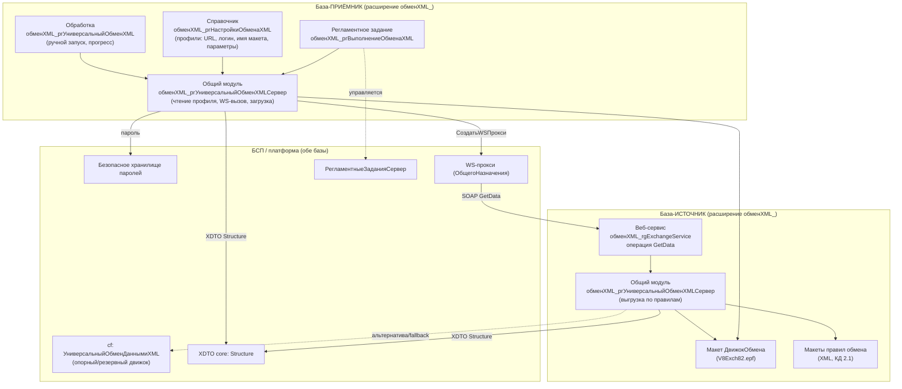
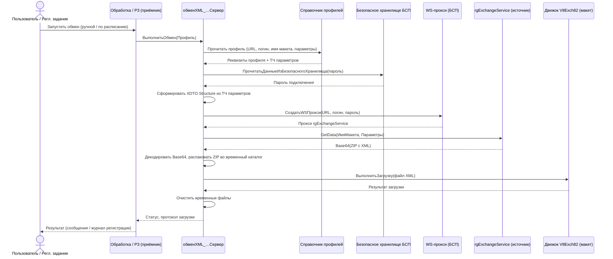
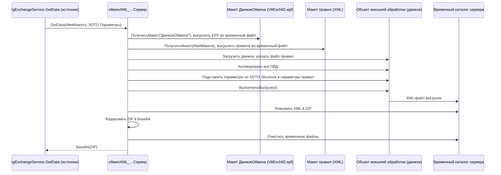

# Архитектура: рг_УниверсальныйОбменXML

## Обзор

`рг_УниверсальныйОбменXML` — универсальная подсистема обмена данными между информационными базами 1С по правилам обмена (КД 2.1) через SOAP-веб-сервис `rgExchangeService`. Модель взаимодействия — **«клиент инициирует, сервер отдаёт»**: база-приёмник хранит профили подключения в справочнике, вызывает метод `GetData` опубликованного веб-сервиса базы-источника, получает ZIP с выгрузкой в XML и загружает данные штатными механизмами универсального обмена. Логика выборки и конвертации вынесена в правила обмена внутри макетов конфигурации-источника; ядро только подставляет параметры фильтрации и запускает правила выгрузки данных (ПВД).

Первый контур разработки и отладки — 1С:ЗУП КОРП 3.1 (3.1.30.197); стратегическая цель — переносимое ядро для любой конфигурации на БСП. Архитектурно это требует **самодостаточного движка обмена**, не зависящего от состава объектов конкретной host-конфигурации, и переиспользования только тех механизмов, которые гарантированно присутствуют в БСП (безопасное хранилище, WS-прокси, регламентные задания). На текущий момент расширение находится в состоянии **скелета**: созданы только язык и основная роль; все прикладные объекты (справочник, обработка, веб-сервис, общий модуль, регламентное задание, макеты) — в стадии планирования.

## Компоненты

Расширение разворачивается на **обеих** базах; роль базы (приёмник / источник) определяется тем, какие компоненты задействованы, а не разными сборками.

### Зоны ответственности расширения

- **Профили и UI приёмника** — справочник настроек обмена, обработка ручного запуска.
- **Транспорт и ядро** — общий серверный модуль: методы веб-сервиса, выгрузка/загрузка, обработчик регламентного задания.
- **Сервисный контракт источника** — веб-сервис `rgExchangeService` с единственной операцией `GetData`.
- **Движок и правила** — макет с движком универсального обмена (V8Exch82) и макеты правил обмена (XML).
- **Автоматизация** — регламентное задание приёмника.
- **Доступ** — основная роль расширения (права на объекты подсистемы и на вызов веб-сервиса).

### Зависимости от базовой конфигурации и БСП

- БСП: безопасное хранилище паролей, фабрика WS-прокси, подсистема регламентных заданий, общие функции (`ОбщегоНазначения`).
- cf: механизм универсального обмена данными XML (обработка `УниверсальныйОбменДаннымиXML` как опорный/резервный движок), платформенный XDTO-пакет `http://v8.1c.ru/8.1/data/core` (тип `Structure`).

### Диаграмма компонентов

## Ключевые потоки данных

### Поток 1. Обмен на стороне приёмника (ручной и регламентный)

Единый серверный сценарий; различие ручного и регламентного запуска — только в точке входа (форма обработки vs обработчик регламентного задания).

### Поток 2. Выгрузка на стороне источника (GetData)

> **Примечание:** в типовой cf-обработке `УниверсальныйОбменДаннымиXML` экспортный метод называется `ВыполнитьВыгрузку()`, не `ВыгрузитьДанные()`.

## Зависимости

### БСП (Библиотека стандартных подсистем)

| Механизм | Использование |
|----------|---------------|
| Безопасное хранилище (`ОбщегоНазначения.ПрочитатьДанныеИзБезопасногоХранилища` / `ЗаписатьДанныеВБезопасноеХранилище`) | Хранение пароля подключения вне реквизитов справочника |
| WS-прокси (`ОбщегоНазначения.СоздатьWSПрокси` или штатная фабрика) | Подключение приёмника к `rgExchangeService` источника |
| `РегламентныеЗаданияСервер` | Создание/управление заданием `обменXML_ргВыполнениеОбменаXML` из справочника профиля |
| Общие функции `ОбщегоНазначения` | Работа с временными файлами, ZIP, кодированием |

### Объекты базовой конфигурации (cf)

| Объект cf | Роль в архитектуре |
|-----------|--------------------|
| Обработка `УниверсальныйОбменДаннымиXML` (`ВыполнитьВыгрузку` / `ВыполнитьЗагрузку`, ZIP) | Опорный механизм универсального обмена; **резервный** движок (стратегия B) |
| XDTO-пакет `http://v8.1c.ru/8.1/data/core`, тип `Structure` | Контракт параметров операции `GetData` |

### Внешние зависимости и публикация

- **Публикация веб-сервиса** на стороне источника через веб-сервер (IIS/Apache) — SOAP-эндпоинт `rgExchangeService`.
- **Сеть**: HTTP(S)-доступ приёмника к URL опубликованного сервиса источника.
- **Серверное ПО**: веб-сервер публикации (конкретная связка уточняется при внедрении).

## Ключевые модули

| Модуль / объект | Расширение / cf | Назначение | Тип |
|-----------------|-----------------|------------|-----|
| `обменXML_ргНастройкиОбменаXML` | расширение | Профили обмена: URL, логин, имя макета правил, ТЧ параметров фильтрации; управление РЗ | Справочник |
| `обменXML_rgExchangeService` | расширение | SOAP-контракт; операция `GetData(ИмяМакета, Параметры) → Base64 ZIP` | Веб-сервис |
| `обменXML_ргУниверсальныйОбменXML` | расширение | UI ручного запуска; хранит макеты `ДвижокОбмена` и правил | Обработка |
| `обменXML_ргУниверсальныйОбменXMLСервер` | расширение | Реализация `GetData`, выгрузка/загрузка, обработчик РЗ, формирование XDTO | Общий модуль (сервер) |
| `обменXML_ргВыполнениеОбменаXML` | расширение | Шаблон программных заданий регламентного обмена | Регламентное задание |
| `обменXML_ОсновнаяРоль` | расширение | Права на объекты подсистемы и на вызов веб-сервиса | Роль |
| `Русский` | расширение | Язык расширения | Язык |
| `УниверсальныйОбменДаннымиXML` | cf | Опорный/резервный движок универсального обмена | Обработка |

> Имена прикладных объектов приведены с обязательным префиксом расширения `обменXML_`. В `project.md` объекты записаны без префикса — требуется выравнивание SSOT.

## Состояние: реализовано vs запланировано

| Объект | Состояние |
|--------|-----------|
| `Language.Русский` | **Существует** (скелет) |
| `Role.обменXML_ОсновнаяРоль` | **Существует** (скелет, права будут дополняться) |
| Справочник `обменXML_ргНастройкиОбменаXML` | Запланировано |
| Веб-сервис `обменXML_rgExchangeService` | Запланировано |
| Обработка `обменXML_ргУниверсальныйОбменXML` | Запланировано |
| Общий модуль `обменXML_ргУниверсальныйОбменXMLСервер` | Запланировано |
| Регламентное задание `обменXML_ргВыполнениеОбменаXML` | Запланировано |
| Макет `ДвижокОбмена` (V8Exch82.epf) | Запланировано |
| Макеты правил обмена (XML) | Запланировано |

Текущая выгрузка `src/ЗУП/cfe/рг_УниверсальныйОбменXML/`: `Configuration.xml`, `ConfigDumpInfo.xml`, `Roles/обменXML_ОсновнаяРоль.xml`, `Languages/Русский.xml`. Прикладные объекты в выгрузке отсутствуют.

## Решения по архитектуре

### 1. Стратегия движка обмена — **вариант A (V8Exch82.epf в макете), приоритетный**

- **A.** EPF V8Exch82.epf в макете `ДвижокОбмена` — движок в расширении, загрузка через внешнюю обработку в рантайме.
- **B.** Вызов cf-обработки `УниверсальныйОбменДаннымиXML` напрямую.
- **C.** Копия кода движка в обработке расширения.

**Выбор: A** — переносимость на любую БСП-конфигурацию. **Резерв на ЗУП:** fallback B при блокировке внешних обработок на сервере.

### 2. Именование метаданных с префиксом `обменXML_`

Канонические имена: `обменXML_ргНастройкиОбменаXML`, `обменXML_rgExchangeService`, `обменXML_ргУниверсальныйОбменXML`, `обменXML_ргУниверсальныйОбменXMLСервер`, `обменXML_ргВыполнениеОбменаXML`.

### 3. Транспортный контракт `GetData`

Вход: имя макета + XDTO `Structure`. Выход: Base64(ZIP с XML). Чанкование — отложено до подтверждения объёмов (ADR-кандидат).

### 4. Хранение учётных данных

Пароль — только в безопасном хранилище БСП; владелец = ссылка профиля.

### ADR-кандидаты

- Стратегия движка (A + условия fallback B).
- Модель pull через `GetData`.
- Транспорт: один SOAP-вызов vs чанкование.
- Безопасное хранилище паролей.
- Соглашение об именовании `обменXML_` + выравнивание с `project.md`.

## Риски

| ID | Риск | Снижение |
|----|------|----------|
| **R1** | Блокировка загрузки V8Exch82.epf на сервере | Профиль безопасности; fallback B на ЗУП |
| **R2** | Расхождение имён project.md vs `обменXML_` | Выравнить SSOT, проверка по выгрузке |
| **R3** | Fallback B не переносим на другие БСП | B только временно на ЗУП |
| **R4** | Пустые обработчики правил для «Строка → Ссылка» | Шаблоны правил, приёмочные сценарии |
| **R5** | Пароль недоступен из РЗ | Права роли, тест под сервисным пользователем |
| **R6** | Лимиты размера Base64(ZIP) | Таймауты WS; ADR чанкования при росте объёмов |
| **R7** | HTTPS, права на WS | HTTPS-публикация; роль + выделенный пользователь |
| **R8** | Коллизии временных файлов при параллельных GetData | Уникальные каталоги на вызов; гарантированная очистка |

## Источники

- `openspec/project.md` — требования и состав объектов.
- `temp/reports/exploration-2026-06-17-rg-universal-exchange-xml.md` — обследование кодовой базы.
- `temp/reports/architecture-2026-06-17-rg-universal-exchange-xml.md` — полный архитектурный отчёт.
